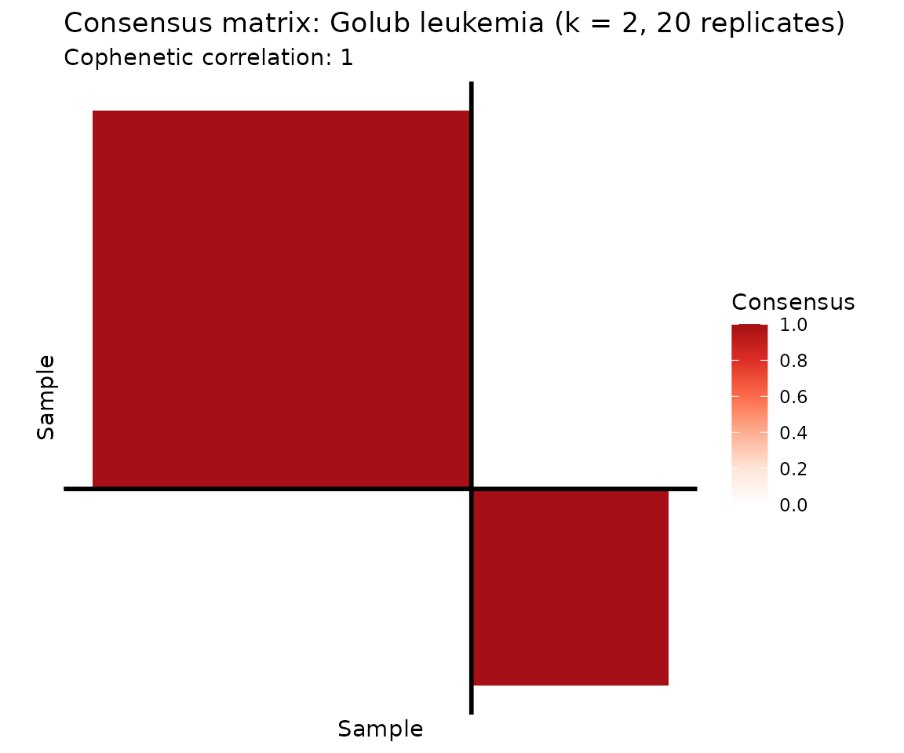
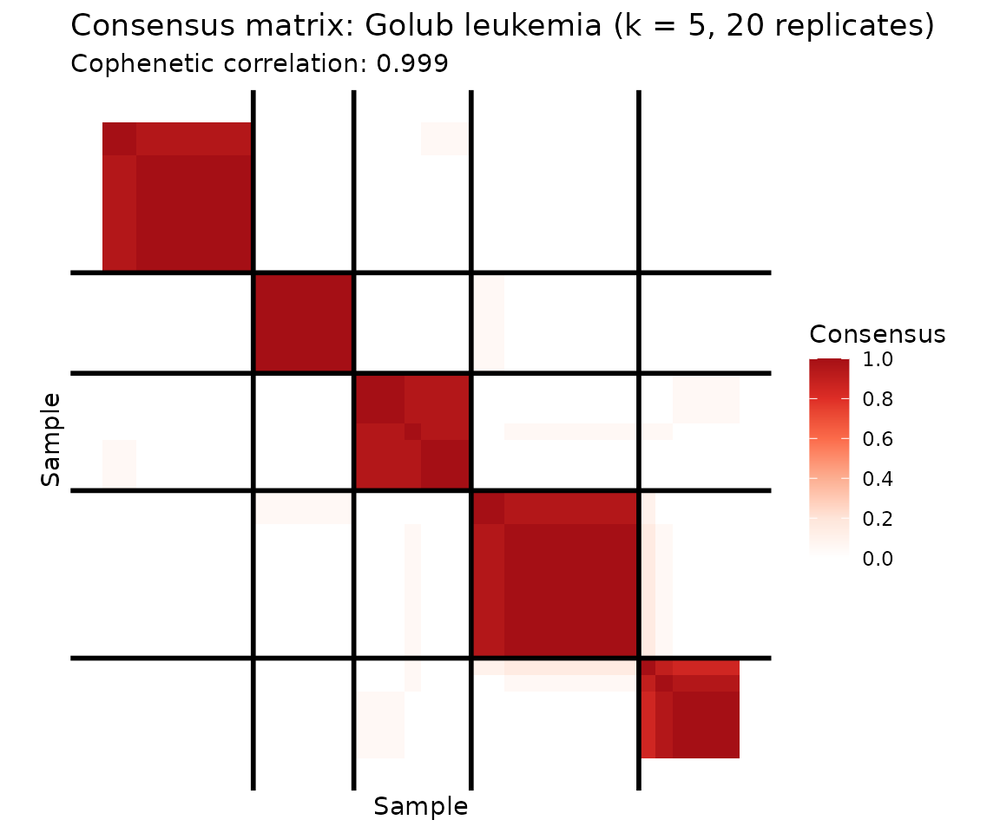
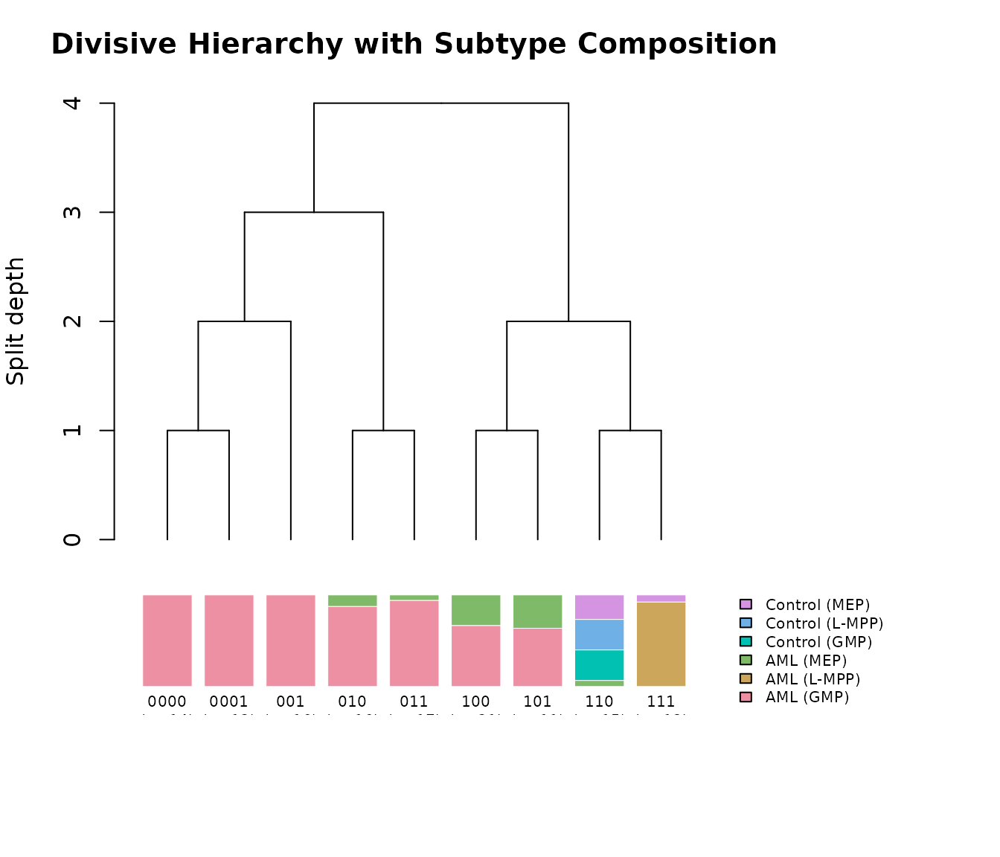
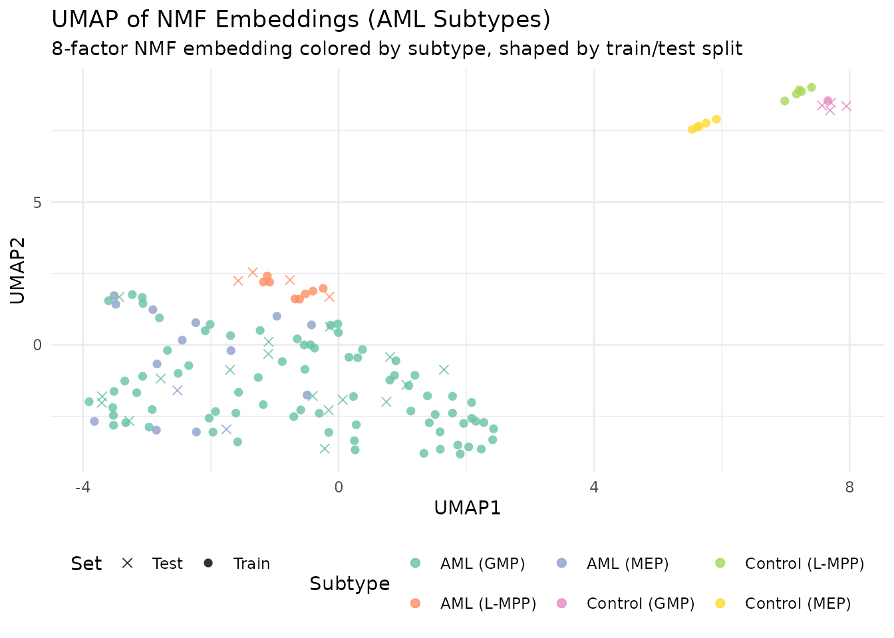

# Clustering, Consensus, and Classification

## Why NMF for Clustering?

NMF is inherently a soft clustering method. Each column of H gives a
sample’s “membership” across k factors, and taking the argmax over rows
yields a hard cluster assignment. However, NMF is non-convex — different
random initializations produce different solutions and potentially
different clusters. **Consensus NMF** addresses this by running many
replicates, tracking which samples consistently co-cluster, and building
a robust consensus matrix.

Beyond flat clustering, RcppML provides **divisive hierarchical
clustering** (`dclust`) via recursive rank-2 NMF splits. The core idea
is that **rank-2 NMF is binary clustering**: each split partitions
samples into two groups based on which of the two factors dominates.
`dclust` applies this recursively, building a full hierarchy — each node
in the tree is a
[`bipartition()`](https://zdebruine.github.io/RcppML/reference/bipartition.md)
that finds the best binary split. Classification from embeddings
leverages the low-dimensional H representation for supervised tasks.

## API Reference

### Consensus NMF

``` r
consensus_nmf(data, k, reps = 50, method = c("hard", "knn_jaccard"),
              knn = 10, seed = NULL, threads = 0, verbose = FALSE, ...)
```

- `data` — input matrix (features × samples) or `.spz` path
- `k` — factorization rank (number of clusters)
- `reps` — number of NMF replicates (more = more stable; use ≤ 30 for
  speed)
- `method` — `"hard"` assigns clusters by dominant factor;
  `"knn_jaccard"` uses k-NN Jaccard overlap (more robust to ambiguity)

Returns a `consensus_nmf` object with `$consensus` (n × n co-clustering
matrix), `$clusters` (assignments), `$cophenetic` (stability metric),
and `$models` (all fitted models).

Use [`plot()`](https://rdrr.io/r/graphics/plot.default.html) for a
consensus heatmap and [`summary()`](https://rdrr.io/r/base/summary.html)
for cluster statistics.

### Divisive Clustering

``` r
bipartition(data, tol = 1e-5, nonneg = TRUE, ...)
dclust(A, min_samples, min_dist = 0, tol = 1e-5, maxit = 100,
       nonneg = TRUE, seed = NULL, threads = 0, verbose = FALSE)
```

[`bipartition()`](https://zdebruine.github.io/RcppML/reference/bipartition.md)
performs a single rank-2 NMF split.
[`dclust()`](https://zdebruine.github.io/RcppML/reference/dclust.md)
recursively bipartitions until clusters are smaller than `min_samples`
or have modularity below `min_dist`.

**Important**:
[`dclust()`](https://zdebruine.github.io/RcppML/reference/dclust.md)
returns 0-indexed `$samples`. Add 1 for R-style indexing.

### Factor Matching

``` r
bipartiteMatch(x)
```

Hungarian algorithm for optimal 1:1 factor correspondence given a
**cost** (dissimilarity) matrix. Returns 0-indexed `$assignment` and
total `$cost`. If using cosine similarity, convert to cost first:
`bipartiteMatch(1 - cosine_sim)`.

### Classification from Embeddings

``` r
classify_embedding(embedding, labels, test_fraction = 0.2, k = 5L, seed = NULL)
classify_logistic(embedding, labels, test_fraction = 0.2, seed = NULL)
```

Both take a samples × features embedding matrix (e.g., `t(model@h)`) and
class labels. Return an `fn_classifier_eval` object with `$accuracy`,
`$macro_f1`, `$confusion`, and per-class metrics.

## Theory

The **consensus matrix** $C$ is defined element-wise: $C_{ij}$ is the
fraction of replicates where samples $i$ and $j$ are assigned to the
same cluster. Perfect clustering produces a binary consensus (0 or 1);
noisy or unstable clustering yields intermediate values.

The **cophenetic correlation** measures how well hierarchical clustering
of the consensus matrix preserves pairwise distances. Higher values
indicate more stable clustering.

**Divisive clustering** recursively applies rank-2 NMF. Each split finds
the best binary partition; the process stops when clusters are too small
or too homogeneous (low modularity).

**Classification from H**: Columns of H are k-dimensional embeddings of
samples. Any classifier (k-NN, logistic regression) applied to these
embeddings can separate classes, assuming they are captured by the NMF
factors.

## Example 1: Cancer Subtype Discovery (Golub Leukemia)

The Golub leukemia dataset contains 38 bone marrow samples — 27 ALL and
11 AML — measured across 5,000 genes. Can unsupervised NMF discover
these known subtypes?

``` r
data(golub)
labels <- attr(golub, "cancer_type")

# Consensus NMF: samples (rows) x genes (columns)
cons <- consensus_nmf(golub, k = 2, reps = 20, seed = 42, verbose = FALSE)
```

``` r
plot(cons, show_clusters = TRUE) +
  ggtitle("Consensus matrix: Golub leukemia (k = 2, 20 replicates)")
```



The consensus heatmap reveals two tightly co-clustered groups. Let’s
check how well they correspond to the known ALL/AML labels.

``` r
# Confusion matrix: consensus clusters vs. true labels
conf <- table(Cluster = paste0("Cluster ", cons$clusters), Cancer = labels)
knitr::kable(conf, caption = "Consensus cluster assignments vs. true cancer type (ALL/AML)")
```

|           | ALL | AML |
|:----------|----:|----:|
| Cluster 1 |  24 |   1 |
| Cluster 2 |   3 |  10 |

Consensus cluster assignments vs. true cancer type (ALL/AML)

> **Reading the confusion matrix**: Each row is a consensus cluster,
> each column a true cancer type. A well-separated clustering aligns
> each row with predominantly one column. Here, Cluster 1 captures
> nearly all ALL samples and Cluster 2 captures most AML samples. The
> overall **purity** (fraction of samples assigned to their majority
> class) is 0.895.

``` r
summary_df <- data.frame(
  Metric = c("Cophenetic correlation", "Cluster 1 size", "Cluster 2 size"),
  Value = c(round(cons$cophenetic, 4),
            sum(cons$clusters == 1),
            sum(cons$clusters == 2))
)
knitr::kable(summary_df, caption = "Consensus NMF summary statistics")
```

| Metric                 | Value |
|:-----------------------|------:|
| Cophenetic correlation |     1 |
| Cluster 1 size         |    25 |
| Cluster 2 size         |    13 |

Consensus NMF summary statistics

Consensus NMF with k = 2 cleanly separates the two leukemia subtypes.
The cophenetic correlation confirms high clustering stability across
replicates.

### Going Deeper: k = 5 Reveals Substructure

What happens when we push beyond the known two classes? With k = 5,
consensus NMF discovers finer-grained substructure within both ALL and
AML.

``` r
cons5 <- consensus_nmf(golub, k = 5, reps = 20, seed = 42, verbose = FALSE)
```

``` r
plot(cons5, show_clusters = TRUE) +
  ggtitle("Consensus matrix: Golub leukemia (k = 5, 20 replicates)")
```



``` r
conf5 <- table(Cluster = paste0("C", cons5$clusters), Cancer = labels)
knitr::kable(conf5, caption = "k = 5 consensus clusters vs. cancer type: substructure within ALL and AML")
```

|     | ALL | AML |
|:----|----:|----:|
| C1  |  10 |   0 |
| C2  |   5 |   1 |
| C3  |   2 |   4 |
| C4  |   9 |   0 |
| C5  |   1 |   6 |

k = 5 consensus clusters vs. cancer type: substructure within ALL and
AML

At k = 5, the consensus matrix reveals that ALL and AML each contain
subpopulations — ALL splits into 2–3 subgroups and AML into 2. A
cophenetic correlation of 0.999 confirms stable cluster boundaries even
at this finer resolution. This substructure is biologically meaningful:
ALL includes B-cell and T-cell subtypes, and AML harbors distinct
genetic programs.

## Example 2: Hierarchical Clustering with dclust (AML Methylation)

The AML dataset contains 824 differentially methylated regions (DMRs)
with beta-value measurements across 135 samples with known subtype
annotations (AML and matched controls at MEP, GMP, and L-MPP progenitor
stages). Divisive clustering discovers a hierarchy of subtypes by
recursively applying rank-2 NMF splits.

``` r
data(aml)
meta <- attr(aml, "metadata_h")

clusters <- dclust(aml, min_samples = 10, min_dist = 0.01, seed = 42)

# Build cluster composition table
cluster_info <- do.call(rbind, lapply(clusters, function(cl) {
  sample_idx <- cl$samples + 1L  # 0-indexed to 1-indexed
  categories <- meta$category[sample_idx]
  top_cats <- sort(table(categories), decreasing = TRUE)
  data.frame(
    Cluster = cl$id,
    Size = cl$size,
    `Top Category` = names(top_cats)[1],
    `Top Count` = as.integer(top_cats[1]),
    `Composition` = paste(paste0(names(top_cats)[1:min(3, length(top_cats))], ":",
                                  as.integer(top_cats[1:min(3, length(top_cats))])),
                          collapse = ", "),
    check.names = FALSE
  )
}))

knitr::kable(head(cluster_info, 8), caption = "Divisive clustering of AML methylation data")
```

| Cluster | Size | Top Category  | Top Count | Composition                                         |
|:--------|-----:|:--------------|----------:|:----------------------------------------------------|
| 111     |   13 | AML (L-MPP)   |        12 | AML (L-MPP):12, Control (MEP):1                     |
| 110     |   15 | Control (GMP) |         5 | Control (GMP):5, Control (L-MPP):5, Control (MEP):4 |
| 101     |   11 | AML (GMP)     |         7 | AML (GMP):7, AML (MEP):4                            |
| 100     |   21 | AML (GMP)     |        14 | AML (GMP):14, AML (MEP):7                           |
| 011     |   17 | AML (GMP)     |        16 | AML (GMP):16, AML (MEP):1                           |
| 010     |   16 | AML (GMP)     |        14 | AML (GMP):14, AML (MEP):2                           |
| 001     |   16 | AML (GMP)     |        16 | AML (GMP):16                                        |
| 0001    |   12 | AML (GMP)     |        12 | AML (GMP):12                                        |

Divisive clustering of AML methylation data

Divisive clustering discovers a hierarchy of subtypes, with early splits
separating biologically distinct cell populations. Each cluster’s
composition reflects known AML subtype structure.

### Splitting Hierarchy

Cluster labels encode the splitting path as binary strings: each
character records whether a node went left (“0”) or right (“1”). The
root split (depth 0) produces children “0” and “1”. Splits at depth 1
subdivide those further: “0” → “00” (left) and “01” (right), and so on.
The string length minus one gives the split depth at which each cluster
was created.

``` r
plot(clusters, labels = meta$category,
     main = "Divisive Hierarchy with Subtype Composition")
```



The top panel shows the true splitting tree with branch points
corresponding to individual
[`bipartition()`](https://zdebruine.github.io/RcppML/reference/bipartition.md)
calls. The bottom panel shows the composition of each leaf cluster as a
stacked bar, aligned with the tree above. The root split (depth 0)
separates biologically distinct cell populations, while deeper splits
resolve finer substructure within AML subtypes.

## Example 3: Classification from NMF Embeddings (AML Subtypes)

AML methylation data provides a realistic multi-class classification
challenge: 6 subtypes with imbalanced class sizes. The NMF embedding
compresses 824 DMRs into k factors; we classify subtypes from this
low-dimensional representation.

``` r
# Fit NMF to AML data (features x samples)
model <- nmf(aml, k = 8, seed = 42, maxit = 100)
embedding <- t(model@h)  # 135 samples x 8 factors
int_labels <- as.integer(factor(meta$category)) - 1L  # 0-indexed

# 20% held-out test set
set.seed(42)
n <- nrow(embedding)
test_idx <- sort(sample(n, floor(n * 0.2)))

knn_eval <- classify_embedding(embedding, int_labels, test_idx = test_idx, k = 5, seed = 42)
log_eval <- classify_logistic(embedding, int_labels, test_idx = test_idx, seed = 42)

comp_table <- data.frame(
  Method = c("k-NN (k=5)", "Logistic regression"),
  Accuracy = c(knn_eval$accuracy, log_eval$accuracy),
  `Macro F1` = c(knn_eval$macro_f1, log_eval$macro_f1),
  check.names = FALSE
)
knitr::kable(comp_table, digits = 3,
             caption = "Classification from NMF embeddings (k = 8, AML subtypes)")
```

| Method              | Accuracy | Macro F1 |
|:--------------------|---------:|---------:|
| k-NN (k=5)          |    0.778 |    0.324 |
| Logistic regression |    0.889 |    0.467 |

Classification from NMF embeddings (k = 8, AML subtypes)

``` r
# k-NN confusion matrix
conf_knn <- knn_eval$confusion
cat_levels <- levels(factor(meta$category))
if (nrow(conf_knn) == length(cat_levels)) {
  rownames(conf_knn) <- cat_levels
  colnames(conf_knn) <- cat_levels
}
knitr::kable(conf_knn, caption = "k-NN confusion matrix (AML subtypes)")
```

|                 | AML (GMP) | AML (L-MPP) | AML (MEP) | Control (GMP) | Control (L-MPP) | Control (MEP) |
|:----------------|----------:|------------:|----------:|--------------:|----------------:|--------------:|
| AML (GMP)       |        17 |           0 |         0 |             0 |               0 |             0 |
| AML (L-MPP)     |         0 |           4 |         0 |             0 |               0 |             0 |
| AML (MEP)       |         2 |           0 |         0 |             0 |               0 |             0 |
| Control (GMP)   |         0 |           0 |         0 |             0 |               4 |             0 |
| Control (L-MPP) |         0 |           0 |         0 |             0 |               0 |             0 |
| Control (MEP)   |         0 |           0 |         0 |             0 |               0 |             0 |

k-NN confusion matrix (AML subtypes)

Unlike the two-class Golub problem (where NMF achieves near-perfect
separation with any classifier), AML’s 6 subtypes with imbalanced class
sizes are harder to classify from 8 factors. The confusion matrix shows
which subtypes are well-resolved and which are confused.

### UMAP of Factor Embeddings

``` r
library(uwot)
set.seed(42)
umap_coords <- umap(embedding, n_neighbors = 15, min_dist = 0.3, n_components = 2)

umap_df <- data.frame(
  UMAP1 = umap_coords[, 1],
  UMAP2 = umap_coords[, 2],
  Subtype = meta$category,
  Set = ifelse(seq_len(n) %in% test_idx, "Test", "Train")
)

ggplot(umap_df, aes(x = UMAP1, y = UMAP2, color = Subtype, shape = Set)) +
  geom_point(size = 2, alpha = 0.8) +
  scale_color_brewer(palette = "Set2") +
  scale_shape_manual(values = c(Train = 16, Test = 4)) +
  labs(title = "UMAP of NMF Embeddings (AML Subtypes)",
       subtitle = "8-factor NMF embedding colored by subtype, shaped by train/test split") +
  theme_minimal() +
  theme(legend.position = "bottom")
```



The UMAP projection reveals how well separated the subtypes are in the
8-dimensional NMF embedding space. Tight, isolated groups indicate
subtypes that will classify well; overlapping groups indicate subtypes
that share methylation structure.

## What’s Next

- *See the [Factor
  Graphs](https://zdebruine.github.io/RcppML/articles/factor-graphs.md)
  vignette for improving embeddings with
  [`refine()`](https://zdebruine.github.io/RcppML/reference/refine.md).*
- *See the
  [Cross-Validation](https://zdebruine.github.io/RcppML/articles/cross-validation.md)
  vignette for choosing the optimal k for clustering.*
- *See the [NMF
  Fundamentals](https://zdebruine.github.io/RcppML/articles/nmf-fundamentals.md)
  vignette for the core NMF API.*
