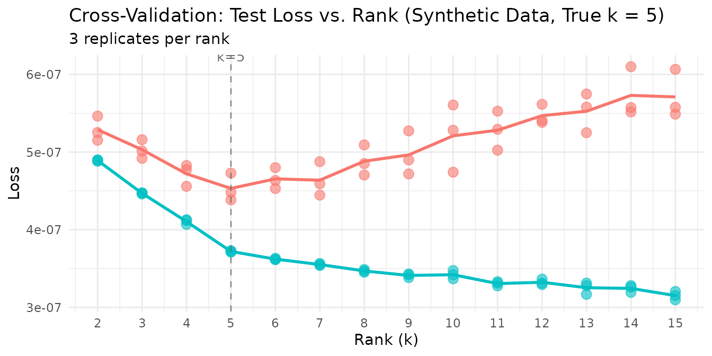
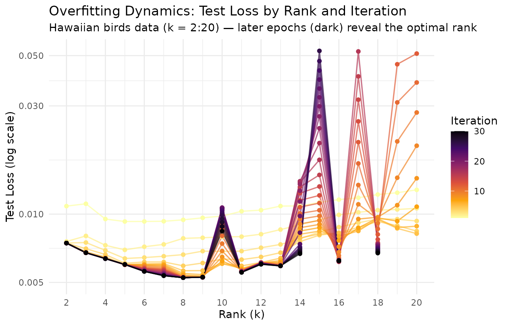
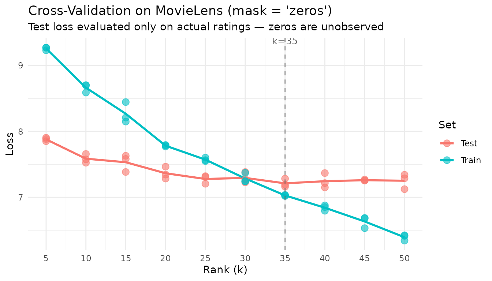
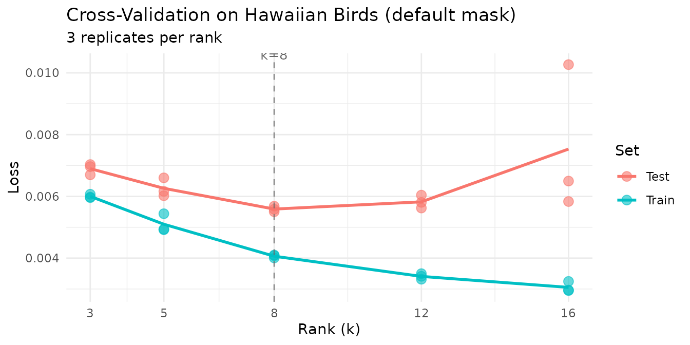
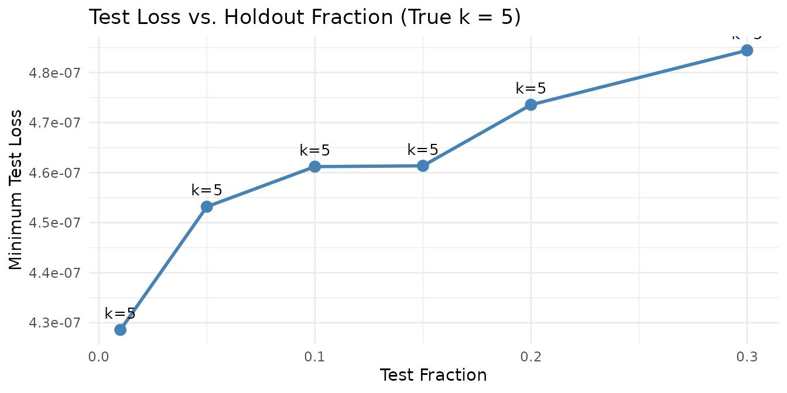

# Cross-Validation for NMF Rank Selection

## Motivation

How many factors does your data really have? Training loss always
decreases as $k$ increases — adding more factors can only improve the
fit on the training data, even when the extra factors are fitting noise.
This makes train loss useless for selecting the optimal rank.

RcppML solves this with **speckled holdout cross-validation**: randomly
mask a fraction of individual matrix entries, fit the NMF model on the
remaining entries, and evaluate reconstruction error on the held-out
entries. Unlike row or column holdout, speckled masking preserves the
full structure of every sample and every feature. The optimal rank $k$
is where the test loss curve forms an “elbow” — decreasing sharply up to
the true rank and flattening or increasing thereafter.

Cross-validation is also one of the most computationally intensive
operations in NMF, since it requires fitting multiple ranks across
multiple replicates. GPU acceleration can provide substantial speedups
(10–50×) for large-scale CV sweeps — see the [GPU
Acceleration](https://zdebruine.github.io/RcppML/articles/gpu-acceleration.md)
vignette.

## API Reference

### Cross-Validation via `nmf()`

Cross-validation is triggered by passing a **vector** to `k`:

``` r
nmf(data, k = c(2, 4, 6, 8, 10),
    test_fraction = 0.1, cv_seed = 1:3,
    mask = NULL, patience = 5, ...)
```

| Parameter       | Default | Description                                                                          |
|-----------------|---------|--------------------------------------------------------------------------------------|
| `k`             | —       | Vector of ranks to evaluate                                                          |
| `test_fraction` | 0       | Fraction of entries held out (set \> 0 for CV)                                       |
| `cv_seed`       | NULL    | Seed(s) for holdout mask. Vector length = number of replicates.                      |
| `mask`          | NULL    | Missing data mask: `NULL`, `"zeros"`, `"NA"`, a matrix, or `list("zeros", <matrix>)` |
| `patience`      | 5       | Early stopping: stop if test loss hasn’t improved in this many iterations            |
| `seed`          | NULL    | Seed for NMF initialization (separate from CV mask)                                  |

**Return value**: A `data.frame` of class `nmfCrossValidate` with
columns:

| Column      | Description                                                                    |
|-------------|--------------------------------------------------------------------------------|
| `k`         | Rank tested                                                                    |
| `rep`       | Replicate index (factor)                                                       |
| `train_mse` | Training set loss (named `train_mse` regardless of the loss function used)     |
| `test_mse`  | Held-out test set loss (named `test_mse` regardless of the loss function used) |
| `best_iter` | Iteration with best test loss                                                  |

Use `plot(cv_result)` for a built-in test-loss-vs-rank curve.

### `mask` Semantics

The `mask` parameter controls both fitting and cross-validation
simultaneously — there is no separate CV-specific mask setting. It
accepts five forms:

- `mask = NULL` (default): All entries (including zeros) can be held
  out. Tests full-matrix reconstruction. Appropriate for dense data or
  applications where zero is a real measurement.
- `mask = "zeros"`: Only nonzero entries can be held out. Zeros are
  treated as “unobserved,” not “zero-valued.” Essential for
  recommendation data (unrated items) and any domain where zero means
  “not measured.”
- `mask = "NA"`: NA entries in the data are treated as missing. If the
  data contains NAs and no mask is specified, this is set automatically
  with a warning.
- `mask = <matrix>`: A custom dgCMatrix or matrix of the same dimensions
  as `data`. Nonzero entries in the mask mark observed positions; zero
  entries mark unobserved positions.
- `mask = list("zeros", <matrix>)`: Combines zero-masking with a custom
  mask — zeros are treated as unobserved *and* the custom mask is
  applied simultaneously.

> **Caution**: Do not compare test loss values across `mask` modes on
> the same axis. With `mask = "zeros"`, the test set only includes
> non-zero entries (e.g., actual ratings), producing loss values on
> their natural scale. With `mask = NULL`, the test set is dominated by
> zero entries, yielding much smaller absolute loss values. The two
> scales are fundamentally different and direct comparison is
> misleading.

## Theory

### Speckled Holdout

For each entry $(i,j)$, include it in the test set with probability
`test_fraction`. All other entries form the training set. This preserves
matrix structure — every row and column retains most of its entries for
training.

### Choosing $k$

Plot test loss against rank and look for the **elbow**: the point where
test loss transitions from steep decrease (capturing real structure) to
a plateau or increase (overfitting noise). Below the elbow, the model is
underfitting. Above, it’s fitting noise.

### Overfitting Dynamics

At the optimal rank, the model captures all real structure without
fitting noise. Overfitting manifests as the test loss increasing while
training loss continues to decrease. Higher ranks are more prone to
overfitting because the model has more capacity to memorize noise in the
training data.

### Multiple Replicates

Different `cv_seed` values produce different holdout masks and different
NMF initializations. Averaging test loss across replicates smooths out
variability from both sources. Use 2–3 replicates for stable results.

## Worked Examples

### Example 1: Recovering True Rank from Synthetic Data

We generate a matrix with exactly 5 true factors and noise, then ask
cross-validation to find the optimal rank.

``` r
sim <- simulateNMF(200, 80, k = 5, noise = 3.0, seed = 42)
cv <- nmf(sim$A, k = 2:15, test_fraction = 0.05, cv_seed = 1:3,
          tol = 1e-5, maxit = 200)
```

``` r
agg <- aggregate(test_mse ~ k, data = cv, FUN = mean)
agg$se <- aggregate(test_mse ~ k, data = cv, FUN = function(x) sd(x) / sqrt(length(x)))$test_mse
optimal_k <- agg$k[which.min(agg$test_mse)]

knitr::kable(
  data.frame(
    k = agg$k,
    `Mean Test Loss` = format(agg$test_mse, digits = 3, scientific = TRUE),
    `SE` = format(agg$se, digits = 3, scientific = TRUE),
    check.names = FALSE
  ),
  caption = paste0("Mean test loss per rank (3 replicates). Optimal k = ", optimal_k, ".")
)
```

|   k | Mean Test Loss | SE       |
|----:|:---------------|:---------|
|   2 | 5.29e-07       | 9.17e-09 |
|   3 | 5.03e-07       | 6.99e-09 |
|   4 | 4.72e-07       | 8.19e-09 |
|   5 | 4.53e-07       | 1.03e-08 |
|   6 | 4.65e-07       | 7.82e-09 |
|   7 | 4.64e-07       | 1.27e-08 |
|   8 | 4.88e-07       | 1.13e-08 |
|   9 | 4.96e-07       | 1.63e-08 |
|  10 | 5.21e-07       | 2.52e-08 |
|  11 | 5.28e-07       | 1.45e-08 |
|  12 | 5.47e-07       | 7.33e-09 |
|  13 | 5.53e-07       | 1.46e-08 |
|  14 | 5.73e-07       | 1.86e-08 |
|  15 | 5.71e-07       | 1.79e-08 |

Mean test loss per rank (3 replicates). Optimal k = 5.

Cross-validation identifies the optimal rank — test loss drops sharply
from k=2 to k=5 (the true rank), then increases beyond k=5 as the model
begins fitting noise rather than structure.

``` r
plot(cv) +
  labs(title = "Cross-Validation: Test Loss vs. Rank (Synthetic Data, True k = 5)") +
  theme_minimal() +
  theme(legend.position = "none")
```



The clear elbow at k=5 confirms that speckled holdout CV recovers the
planted rank. The individual replicate points cluster tightly, showing
that 3 replicates suffice for stable estimates at this matrix size.

### Example 2: Overfitting Dynamics (Epoch Plot)

Cross-validation works because overfitting worsens at higher ranks: more
factors mean more capacity to memorize the training data. We can
visualize this by tracking test loss at every iteration across multiple
ranks, using the `on_iteration` callback to capture per-epoch dynamics.

``` r
data(hawaiibirds)
ranks_to_show <- 2:20

# Capture per-iteration test loss at each rank
track_test <- function() {
  losses <- numeric(0)
  list(
    callback = function(iter, train_loss, test_loss) { losses[iter] <<- test_loss },
    get = function() losses
  )
}

iter_logs <- do.call(rbind, lapply(ranks_to_show, function(k_val) {
  tracker <- track_test()
  nmf(hawaiibirds, k = k_val, test_fraction = 0.1, cv_seed = 1, seed = 42,
      tol = 0, maxit = 30, patience = 30, on_iteration = tracker$callback)
  losses <- tracker$get()
  data.frame(k = k_val, iter = seq_along(losses), test_loss = losses)
}))
```

The **epoch plot** displays rank on the x-axis and test loss on the
y-axis, with lines colored by iteration. Early iterations (bright) show
high test loss at all ranks; as training progresses (dark), the optimal
rank emerges as the one with the steepest improvement.

``` r
# Bound y-axis: from min test loss to 10x that
min_loss <- min(iter_logs$test_loss)
y_lo <- min_loss * 0.95
y_hi <- min_loss * 10

ggplot(iter_logs, aes(x = k, y = test_loss, color = iter, group = iter)) +
  geom_line(alpha = 0.7, linewidth = 0.6) +
  geom_point(size = 1.5) +
  scale_color_viridis_c(option = "B", direction = -1) +
  scale_y_continuous(trans = "log10", limits = c(y_lo, y_hi)) +
  scale_x_continuous(breaks = seq(2, 20, by = 2)) +
  labs(
    title = "Overfitting Dynamics: Test Loss by Rank and Iteration",
    subtitle = "Hawaiian birds data (k = 2:20) — later epochs (dark) reveal the optimal rank",
    x = "Rank (k)", y = "Test Loss (log scale)", color = "Iteration"
  ) +
  theme_minimal()
```



Each line traces a single training epoch across ranks. At the optimal
rank, test loss drops furthest as training progresses. At excessively
high ranks, diminishing improvement (or rising test loss in later
epochs) signals overfitting — the extra capacity is fitting noise rather
than structure. The y-axis is clipped to 10× the minimum test loss to
focus on the informative range.

### Example 3: Recommendation Data with `mask = "zeros"`

The `movielens` dataset (3,867 movies × 610 users) contains star ratings
from 1–5. Most entries are zero — meaning the user has not rated that
movie, *not* that they gave it zero stars. The `mask = "zeros"` setting
is essential here: it restricts the holdout set to actual ratings and
treats zeros as unobserved.

``` r
data(movielens)

cat("MovieLens dimensions:", nrow(movielens), "×", ncol(movielens), "\n")
#> MovieLens dimensions: 3867 × 610
cat("Sparsity:", round(1 - Matrix::nnzero(movielens) / prod(dim(movielens)), 4) * 100, "%\n")
#> Sparsity: 96.81 %

ranks <- seq(5, 50, by = 5)
cv_movielens <- nmf(movielens, k = ranks, test_fraction = 0.1,
                    mask = "zeros", cv_seed = 1:3, tol = 1e-3, maxit = 100)
```

``` r
agg_ml <- aggregate(test_mse ~ k, data = cv_movielens, FUN = mean)

plot(cv_movielens) +
  labs(
    title = "Cross-Validation on MovieLens (mask = 'zeros')",
    subtitle = "Test loss evaluated only on actual ratings — zeros are unobserved"
  ) +
  theme_minimal()
```



``` r
agg_ml$se <- aggregate(test_mse ~ k, data = cv_movielens, FUN = function(x) sd(x) / sqrt(length(x)))$test_mse
opt_ml <- agg_ml$k[which.min(agg_ml$test_mse)]

knitr::kable(
  data.frame(
    k = agg_ml$k,
    `Mean Test Loss` = round(agg_ml$test_mse, 4),
    `SE` = round(agg_ml$se, 4),
    check.names = FALSE
  ),
  caption = paste0("MovieLens CV results (mask = 'zeros'). Optimal k = ", opt_ml, ".")
)
```

|   k | Mean Test Loss |     SE |
|----:|---------------:|-------:|
|   5 |         7.8795 | 0.0153 |
|  10 |         7.5856 | 0.0386 |
|  15 |         7.5319 | 0.0752 |
|  20 |         7.3647 | 0.0531 |
|  25 |         7.2782 | 0.0364 |
|  30 |         7.2941 | 0.0467 |
|  35 |         7.2119 | 0.0367 |
|  40 |         7.2442 | 0.0646 |
|  45 |         7.2597 | 0.0048 |
|  50 |         7.2512 | 0.0658 |

MovieLens CV results (mask = ‘zeros’). Optimal k = 35.

With `mask = "zeros"`, cross-validation evaluates only the prediction of
actual ratings — exactly the task a recommendation system performs.

### Example 4: Ecological Survey Data

The `hawaiibirds` dataset records 183 bird species across 1,183 grid
cells. In ecological surveys, zeros typically mean “species not
detected” rather than “measured abundance is zero.” We use the default
`mask = NULL` here because we want to evaluate the model’s ability to
reconstruct the full abundance matrix, including correctly predicting
that many species are absent from many sites.

``` r
data(hawaiibirds)

ranks <- c(3, 5, 8, 12, 16)
cv_birds <- nmf(hawaiibirds, k = ranks, test_fraction = 0.1,
                cv_seed = 1:3, tol = 1e-3, maxit = 50)
```

``` r
plot(cv_birds) +
  labs(title = "Cross-Validation on Hawaiian Birds (default mask)") +
  theme_minimal()
```



### Example 5: Effect of `test_fraction`

We compare different holdout fractions to show how they affect rank
selection stability. The true planted rank is 5.

``` r
fractions <- c(0.01, 0.05, 0.1, 0.15, 0.2, 0.3)
fraction_results <- do.call(rbind, lapply(fractions, function(frac) {
  cv_res <- nmf(sim$A, k = 2:15, test_fraction = frac, cv_seed = 1:3,
                tol = 1e-4, maxit = 100)
  agg <- aggregate(test_mse ~ k, data = cv_res, FUN = mean)
  se_vals <- aggregate(test_mse ~ k, data = cv_res, FUN = function(x) sd(x) / sqrt(length(x)))$test_mse
  data.frame(
    test_fraction = frac,
    optimal_k = agg$k[which.min(agg$test_mse)],
    min_test_loss = min(agg$test_mse),
    mean_se = mean(se_vals)
  )
}))
```

``` r
knitr::kable(
  data.frame(
    `Test Fraction` = fraction_results$test_fraction,
    `Selected k` = fraction_results$optimal_k,
    `Min Test Loss` = format(fraction_results$min_test_loss, digits = 3, scientific = TRUE),
    `Mean SE` = format(fraction_results$mean_se, digits = 3, scientific = TRUE),
    check.names = FALSE
  ),
  caption = "Effect of test_fraction on rank selection (synthetic data, true k = 5).",
  row.names = FALSE
)
```

| Test Fraction | Selected k | Min Test Loss | Mean SE  |
|--------------:|-----------:|:--------------|:---------|
|          0.01 |          5 | 4.29e-07      | 3.94e-08 |
|          0.05 |          5 | 4.53e-07      | 1.32e-08 |
|          0.10 |          5 | 4.61e-07      | 1.01e-08 |
|          0.15 |          5 | 4.61e-07      | 1.07e-08 |
|          0.20 |          5 | 4.74e-07      | 1.09e-08 |
|          0.30 |          5 | 4.84e-07      | 1.00e-08 |

Effect of test_fraction on rank selection (synthetic data, true k = 5).

``` r
ggplot(fraction_results, aes(x = test_fraction, y = min_test_loss)) +
  geom_line(linewidth = 1, color = "steelblue") +
  geom_point(size = 3, color = "steelblue") +
  geom_text(aes(label = paste0("k=", optimal_k)),
            vjust = -1, size = 3.5) +
  labs(
    title = "Test Loss vs. Holdout Fraction (True k = 5)",
    x = "Test Fraction", y = "Minimum Test Loss"
  ) +
  theme_minimal()
```



Rank selection is robust across a wide range of holdout fractions. Very
small fractions (1%) have higher variance due to the small test set,
while very large fractions (30%) leave less data for training.

> **Computational cost scales with test fraction.** Every masked entry
> requires a per-iteration prediction and loss evaluation against the
> current model, adding $O(k)$ work per held-out entry at every epoch.
> Doubling the test fraction roughly doubles this overhead — and for
> large sparse matrices the masked-entry bookkeeping can dominate total
> runtime. A test fraction of **1–5%** is usually sufficient for stable
> rank selection while keeping the computational burden negligible
> relative to the NMF solve itself. Reserve larger fractions (10–20%)
> only for small matrices where the absolute number of test entries
> would otherwise be too few for reliable estimates.

## Next Steps

- **Distribution-aware CV**: Use non-MSE loss functions for count data.
  See the
  [Distributions](https://zdebruine.github.io/RcppML/articles/distributions.md)
  vignette.
- **Robust factorization**: Combine CV-selected rank with
  [`consensus_nmf()`](https://zdebruine.github.io/RcppML/reference/consensus_nmf.md)
  for stable factors across multiple runs. See
  [Clustering](https://zdebruine.github.io/RcppML/articles/clustering.md).
- **GPU acceleration**: Speed up large CV sweeps by 10–50× on GPUs. See
  [GPU
  Acceleration](https://zdebruine.github.io/RcppML/articles/gpu-acceleration.md).
