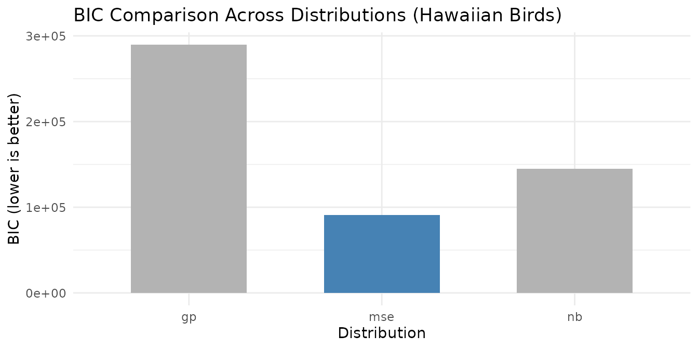

# Statistical Distributions for NMF

## Motivation

Standard NMF minimizes mean squared error, implicitly assuming Gaussian
noise with constant variance. This assumption fails for many real
datasets: count data (gene expression, species surveys) has variance
proportional to the mean; heavy-tailed data has extreme outliers that
dominate the MSE objective; and some data has excess zeros far beyond
what any single distribution predicts (e.g., single-cell RNA-seq
dropout).

RcppML unifies distribution-specific NMF via Iteratively Reweighted
Least Squares (IRLS): at each NMF iteration, the least squares
subproblem is re-weighted to match the chosen distribution’s variance
function. The result is better fit, more interpretable factors, and
statistically principled modeling.

## API Reference

### Distribution Selection in `nmf()`

Use the `loss` parameter to specify the error distribution:

``` r
nmf(data, k, loss = "gp", ...)
```

| Distribution        | `loss =`             | $V(\mu)$              | Use Case                 |
|---------------------|----------------------|-----------------------|--------------------------|
| Gaussian            | `"mse"`              | constant              | Dense continuous data    |
| Generalized Poisson | `"gp"`               | $\mu + \theta\mu^{2}$ | Overdispersed counts     |
| Negative Binomial   | `"nb"`               | $\mu + \mu^{2}/r$     | Standard count data      |
| Gamma               | `"gamma"`            | $\mu^{2}$             | Positive continuous data |
| Inverse Gaussian    | `"inverse_gaussian"` | $\mu^{3}$             | Heavy right tails        |
| Tweedie             | `"tweedie"`          | $\mu^{p}$             | Hybrid count/continuous  |

### Dispersion Control

The `dispersion` parameter controls how dispersion is estimated:

| Value       | Description                                    |
|-------------|------------------------------------------------|
| `"per_row"` | One dispersion parameter per feature (default) |
| `"per_col"` | One per sample                                 |
| `"global"`  | Single global dispersion                       |
| `"none"`    | No dispersion estimation                       |

### Zero-Inflation

For data with excess zeros beyond what the chosen distribution predicts:

``` r
nmf(data, k, loss = "gp", zi = "row", ...)
```

| `zi =`   | Description                                        |
|----------|----------------------------------------------------|
| `"none"` | No zero-inflation modeling (default)               |
| `"row"`  | Per-row (per-feature) zero-inflation probability   |
| `"col"`  | Per-column (per-sample) zero-inflation probability |

### Diagnostic Functions

- `auto_nmf_distribution(data, k, distributions, criterion)` — fit
  multiple distributions, compare via AIC/BIC
- `score_test_distribution(data, model, powers)` — score test for
  variance power without refitting
- `diagnose_zero_inflation(data, model, threshold)` — test for excess
  zeros
- `diagnose_dispersion(data, model)` — recommend dispersion granularity

## Theory

### Variance-Mean Relationship

Each distribution assumes a specific relationship between the variance
and the mean: $V(\mu) = \mu^{p}$. Gaussian (p=0) has constant variance.
Poisson-family (p=1) has variance proportional to mean. Gamma (p=2) has
variance proportional to mean squared. The correct assumption determines
how residuals are weighted — high-mean entries get downweighted for
count data, matching the natural heteroscedasticity.

### IRLS

At each NMF iteration, IRLS computes weights
$w_{ij} = 1/V\left( {\widehat{\mu}}_{ij} \right)$ and solves the
weighted NNLS problem. This iterative reweighting converges to the
maximum likelihood estimate for the chosen distribution.

### Dispersion

Dispersion controls how much the observed variance deviates from the
base variance function. For Negative Binomial, the dispersion parameter
$\theta$ controls overdispersion: $V(\mu) = \mu + \mu^{2}/\theta$. For
Generalized Poisson, $\phi$ controls extra-Poisson variation.

The three dispersion modes control granularity:

- **`per_row`** (default): Each feature (row) gets its own dispersion
  $\phi_{i}$. Appropriate when features have different noise levels —
  e.g., highly-expressed genes have different variance structure than
  lowly-expressed genes.
- **`per_col`**: Each sample (column) gets its own dispersion
  $\phi_{j}$. Appropriate when samples have different quality — e.g.,
  cells with different sequencing depth or capture efficiency.
- **`global`**: A single scalar dispersion $\phi$ for the entire matrix.
  Appropriate for homogeneous data where all features and samples have
  similar noise characteristics.

**Guidance**: For gene expression data, `per_row` is typically best
(genes vary enormously in expression level and noise). For
batch-variable data, `per_col` captures sample-level quality
differences. Use
[`diagnose_dispersion()`](https://zdebruine.github.io/RcppML/reference/diagnose_dispersion.md)
to choose empirically.

### Zero-Inflation

The ZI mixture model decomposes each observation as:
$P(X = 0) = \pi + (1 - \pi) \cdot f\left( 0|\mu \right)$. The EM
algorithm alternates between estimating zero-inflation probabilities
$\pi$ and updating NMF factors — capturing dropout or structural zeros
that the base distribution cannot explain.

### Recommended Workflow

When modeling complex data, build up complexity incrementally rather
than estimating everything simultaneously. Estimating distribution,
dispersion, and zero-inflation together creates identifiability issues —
the model may trade off between a more flexible distribution and higher
zero-inflation, producing unstable results.

1.  **Select distribution**: Use
    [`auto_nmf_distribution()`](https://zdebruine.github.io/RcppML/reference/auto_nmf_distribution.md)
    or
    [`score_test_distribution()`](https://zdebruine.github.io/RcppML/reference/score_test_distribution.md)
    to find the best variance function. Start with `dispersion = "none"`
    and `zi = "none"`.
2.  **Diagnose dispersion**: Use
    [`diagnose_dispersion()`](https://zdebruine.github.io/RcppML/reference/diagnose_dispersion.md)
    to determine whether per-row, per-col, or global dispersion is
    needed.
3.  **Test for zero-inflation**: Use
    [`diagnose_zero_inflation()`](https://zdebruine.github.io/RcppML/reference/diagnose_zero_inflation.md)
    to check for excess zeros.
4.  **Combine**: Fit the final model with the chosen distribution,
    dispersion mode, and ZI setting.

> **Tip**: The `distribution` parameter (available in
> [`auto_nmf_distribution()`](https://zdebruine.github.io/RcppML/reference/auto_nmf_distribution.md))
> can be set to `"auto"` for automatic distribution selection. This
> evaluates multiple candidates and selects the best one by the
> specified criterion (default: BIC).

### Information Criteria

Distribution comparison uses standard model selection criteria:

- **NLL** (Negative Log-Likelihood): The negative log-likelihood of the
  data under the fitted model. Lower = better fit.
- **AIC** (Akaike Information Criterion):
  $\text{AIC} = 2 \cdot \text{NLL} + 2k$, where $k$ is the number of
  parameters. Penalizes model complexity lightly.
- **BIC** (Bayesian Information Criterion):
  $\text{BIC} = 2 \cdot \text{NLL} + k\log(N)$, where $N$ is the number
  of observations. Penalizes complexity more strongly than AIC,
  preferring simpler models. **BIC is generally preferred** for
  distribution selection.

Note: NLL and AIC/BIC values can be negative — this reflects the scale
of the log-likelihood, not an error.

## Worked Examples

### Example 1: Distribution Auto-Selection on Count Data

The `hawaiibirds` dataset contains species frequency counts from
Hawaiian bird surveys — overdispersed count data where Gaussian
assumptions are inappropriate.

``` r
data(hawaiibirds)
result <- auto_nmf_distribution(hawaiibirds, k = 8,
                                 distributions = c("mse", "gp", "nb"),
                                 criterion = "bic", seed = 42,
                                 maxit = 30)
```

``` r
comp <- result$comparison
comp_display <- data.frame(
  Distribution = comp$distribution,
  NLL = round(comp$nll, 1),
  df = comp$df,
  AIC = round(comp$aic, 1),
  BIC = round(comp$bic, 1),
  Selected = ifelse(comp$selected, "***", "")
)
knitr::kable(
  comp_display,
  caption = paste0("Distribution comparison on hawaiibirds (BIC criterion). Best: ", result$loss, ".")
)
```

| Distribution |      NLL |    df |      AIC |      BIC | Selected |
|:-------------|---------:|------:|---------:|---------:|:---------|
| mse          | -11136.2 | 10929 |   -414.4 |  90687.0 | \*\*\*   |
| gp           |  87417.5 | 11111 | 197056.9 | 289675.5 |          |
| nb           |  15109.6 | 11111 |  52441.3 | 145059.9 |          |

Distribution comparison on hawaiibirds (BIC criterion). Best: mse.

``` r
ggplot(comp, aes(x = distribution, y = bic, fill = selected)) +
  geom_col(width = 0.6) +
  scale_fill_manual(values = c("FALSE" = "grey70", "TRUE" = "steelblue"), guide = "none") +
  labs(title = "BIC Comparison Across Distributions (Hawaiian Birds)",
       x = "Distribution", y = "BIC (lower is better)") +
  theme_minimal()
```



BIC selects the best-fitting distribution for the Hawaiian bird count
data. Note that the BIC-preferred distribution may not always be a
count-based model: if the variance-mean relationship in the data is
closer to constant (Gaussian), BIC will prefer MSE over more complex
alternatives. This is informative — it tells you whether the additional
complexity of a count-based loss is warranted for your data. Higher BIC
values for count distributions indicate that the extra dispersion
parameters are not justified by the improvement in fit.

``` r
# Diagnose dispersion granularity for the best model
best_model <- result$models[[result$loss]]
disp_diag <- diagnose_dispersion(hawaiibirds, best_model)

disp_df <- data.frame(
  Property = c("Recommended mode", "Global φ", "Row CV", "Col CV"),
  Value = c(disp_diag$mode, round(disp_diag$global_phi, 4),
            round(disp_diag$row_cv, 4), round(disp_diag$col_cv, 4))
)
knitr::kable(disp_df, caption = "Dispersion diagnostics for hawaiibirds")
```

| Property         | Value   |
|:-----------------|:--------|
| Recommended mode | per_row |
| Global φ         | 4e-04   |
| Row CV           | 1.9884  |
| Col CV           | 0.867   |

Dispersion diagnostics for hawaiibirds

### Example 2: Score Test Diagnostics

The score test evaluates the variance-power family without refitting — a
fast diagnostic to determine which distribution matches the data’s
variance structure.

``` r
model_base <- nmf(hawaiibirds, k = 8, seed = 42, tol = 1e-3, maxit = 30)
scores <- score_test_distribution(hawaiibirds, model_base)
```

``` r
score_df <- scores$scores
score_df$T_stat <- round(score_df$T_stat, 4)
score_df$abs_T <- round(score_df$abs_T, 4)
knitr::kable(
  score_df,
  caption = paste0("Score test results. Best power: p = ", scores$best_power,
                    " (", scores$best_distribution, ").")
)
```

| power |        T_stat |        abs_T | distribution     |
|------:|--------------:|-------------:|:-----------------|
|     0 | -9.786000e-01 | 9.786000e-01 | gaussian         |
|     1 |  4.389000e-01 | 4.389000e-01 | gp               |
|     2 |  1.124376e+06 | 1.124376e+06 | gamma            |
|     3 |  1.115849e+12 | 1.115849e+12 | inverse_gaussian |

Score test results. Best power: p = 1 (gp).

The power with the smallest $|T|$ best matches the observed
variance-mean relationship. The score test evaluates the variance power
family $V(\mu) = \mu^{p}$:

- **Power 0** (Gaussian): constant variance — if rejected (large $|T|$),
  the data has heteroscedastic noise.
- **Power 1** (Poisson/GP): variance proportional to mean — appropriate
  for count data.
- **Power 2** (Gamma): variance proportional to mean-squared —
  appropriate for heavy-tailed continuous data.

A negative T-statistic at a given power suggests the model
over-estimates variance relative to the data at that power — the assumed
variance function grows too quickly with the mean. A positive
T-statistic suggests under-estimation — the data has more variance than
the model predicts. The best power is the one where the T-statistic is
closest to zero — the variance assumption matches reality. In practice,
small absolute T-statistics (\< 0.1) across multiple powers suggest the
data’s variance-mean relationship is well-behaved and the choice of
distribution matters less.

``` r
if (!is.null(scores$nb_diagnostic)) {
  nb_msg <- if (scores$nb_diagnostic$overdispersed) {
    "Substantial overdispersion detected (T_NB > 0.1). NB or GP may be preferable to Poisson."
  } else {
    "No strong overdispersion beyond Poisson detected."
  }
}
```

### Example 3: Zero-Inflation Detection and Modeling

Single-cell RNA-seq data has extreme sparsity with “dropout” zeros
beyond what any count distribution predicts. We use `pbmc3k`, a
variance-selected subset (8,000 genes × 500 cells) of the full 10x
Genomics PBMC 3k dataset.

Dropout is a pervasive artifact of scRNA-seq: during library
preparation, low-abundance mRNAs are stochastically lost at the capture
and reverse-transcription steps. The result is that genes with moderate
true expression are frequently observed as zero — not because the cell
lacks the transcript, but because the assay failed to detect it. This
produces “excess zeros” far beyond what any single count distribution
(Poisson, NB, GP) can explain. Capture efficiency also varies across
cells, contributing to per-sample zero-inflation.

> **Not all sparse data has excess zeros.** For example, `hawaiibirds`
> is 97% sparse but
> [`diagnose_zero_inflation()`](https://zdebruine.github.io/RcppML/reference/diagnose_zero_inflation.md)
> finds an excess zero rate below 1% — the zeros are well-explained by
> the count distribution itself. Zero-inflation modeling adds value only
> when the diagnostic confirms structural excess zeros.

``` r
data(pbmc3k, package = "RcppML")
tmp <- tempfile(fileext = ".spz")
writeBin(pbmc3k, tmp)
counts <- st_read(tmp)

sparsity_pct <- round(100 * (1 - Matrix::nnzero(counts) / prod(dim(counts))), 1)
cat("Dimensions:", nrow(counts), "×", ncol(counts), "\n")
#> Dimensions: 13714 × 2638
```

The dataset has 93.8% zeros — far more than any single count
distribution can explain.

``` r
model_gp <- nmf(counts, k = 8, loss = "gp", seed = 42, tol = 1e-3, maxit = 30)
zi_diag <- diagnose_zero_inflation(counts, model_gp)
```

``` r
zi_summary <- data.frame(
  Metric = c("Excess Zero Rate", "Zero-Inflation Detected", "Recommended ZI Mode"),
  Value = c(
    round(zi_diag$excess_zero_rate, 4),
    as.character(zi_diag$has_zi),
    zi_diag$zi_mode
  )
)
knitr::kable(zi_summary, caption = "Zero-inflation diagnostics on pbmc3k (8,000 genes × 500 cells).")
```

| Metric                  | Value  |
|:------------------------|:-------|
| Excess Zero Rate        | 0.2287 |
| Zero-Inflation Detected | TRUE   |
| Recommended ZI Mode     | col    |

Zero-inflation diagnostics on pbmc3k (8,000 genes × 500 cells).

``` r
if (zi_diag$has_zi && zi_diag$zi_mode != "none") {
  model_zi <- nmf(counts, k = 8, loss = "gp", zi = zi_diag$zi_mode,
                  seed = 42, tol = 1e-3, maxit = 30)
  
  loss_gp <- evaluate(model_gp, counts, loss = "mse")
  loss_zi <- evaluate(model_zi, counts, loss = "mse")
  improvement <- round(100 * (1 - loss_zi / loss_gp), 1)
  
  loss_comp <- data.frame(
    Model = c("GP", paste0("GP + ZI (", zi_diag$zi_mode, ")")),
    `MSE` = round(c(loss_gp, loss_zi), 4),
    check.names = FALSE
  )
  knitr::kable(loss_comp, caption = "Reconstruction error: GP vs. GP with zero-inflation.")
}
```

## Next Steps

- **Rank selection with distributions**: Cross-validate with
  `loss = "gp"` or `"nb"`. See the
  [Cross-Validation](https://zdebruine.github.io/RcppML/articles/cross-validation.md)
  vignette.
- **Factor interpretation**: Combine distribution-aware NMF with
  consensus clustering. See the Clustering vignette.
- **Core NMF mechanics**: For Gaussian/MSE NMF fundamentals, see [NMF
  Fundamentals](https://zdebruine.github.io/RcppML/articles/nmf-fundamentals.md).
