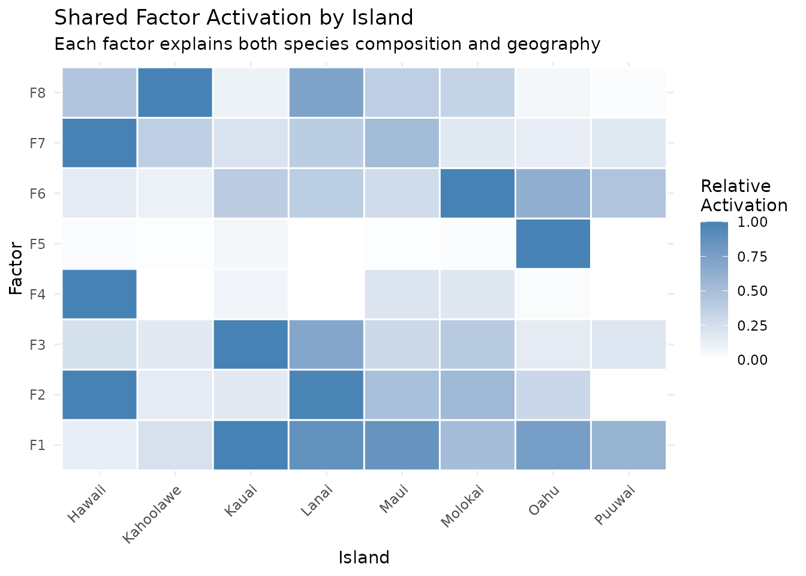
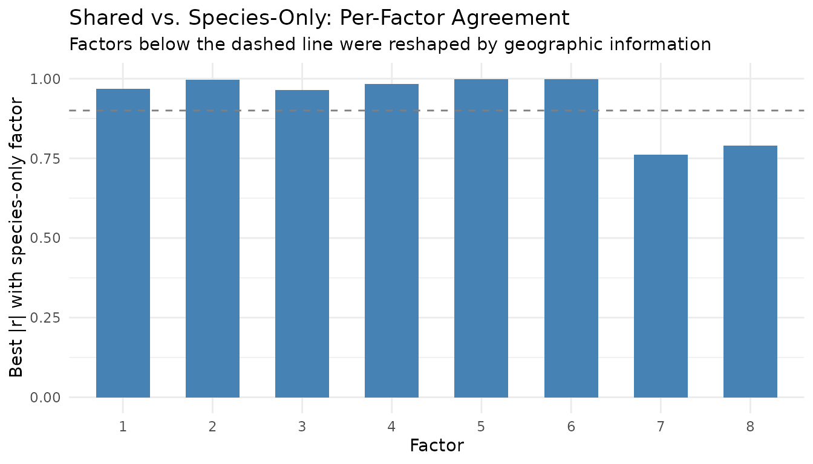
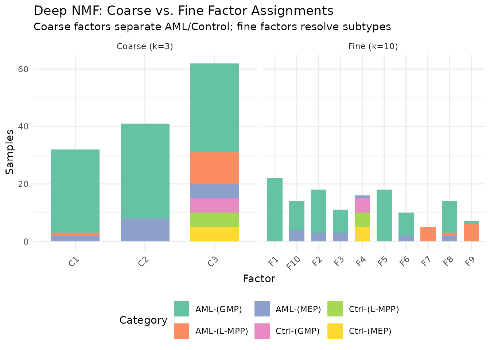
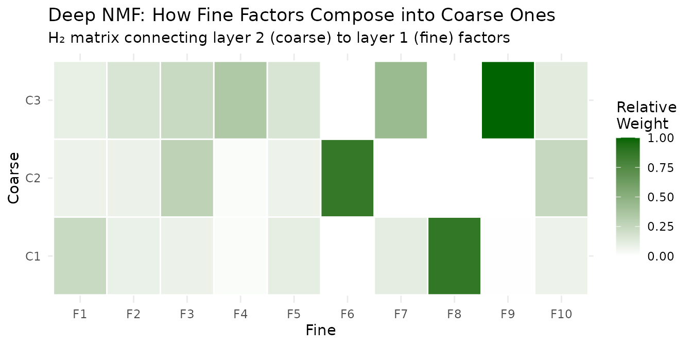
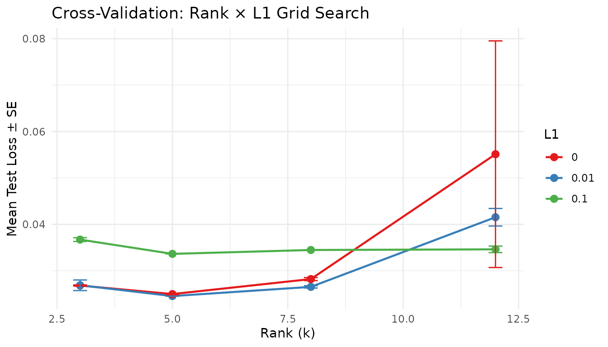

# Factorization Graphs

## Why Factorization Graphs?

[`nmf()`](https://zdebruine.github.io/RcppML/reference/nmf.md)
decomposes one matrix into two factors. That covers a lot of ground —
but real problems often involve richer structure:

- **Multi-modal data**: Two matrices sharing the same samples should
  share a single latent space, not be factorized independently.
- **Hierarchical decomposition**: Coarse global patterns and fine local
  patterns live at different ranks — stacking NMF layers captures both.
- **Guided factorization**: Prior knowledge (class labels, reference
  patterns) should steer the optimization, not be bolted on afterward.
- **Systematic tuning**: Rank, regularization, and loss function
  interact in nonobvious ways — you need a principled way to search over
  them together.

RcppML’s
[`factor_net()`](https://zdebruine.github.io/RcppML/reference/factor_net.md)
addresses all of these by treating factorization as a **directed graph**
of composable blocks. You wire together inputs, layers, and merge
operations, then
[`fit()`](https://zdebruine.github.io/RcppML/reference/fit.md) the
assembled network.

## Building Blocks

| Function                     | Role                                                                      |
|:-----------------------------|:--------------------------------------------------------------------------|
| `factor_input(data)`         | Wraps a dense matrix, sparse matrix, or `.spz` file path as a graph input |
| `nmf_layer(input, k)`        | NMF layer: *A ≈ W diag(d) H*, non-negative                                |
| `svd_layer(input, k)`        | SVD/PCA layer: signed, optional centering/scaling                         |
| `factor_shared(...)`         | Row-binds multiple inputs; one NMF shares *H* across all                  |
| `factor_concat(...)`         | Stacks *H* matrices from parallel branches (expands rank)                 |
| `factor_add(...)`            | Element-wise *H* addition (skip connection, same rank)                    |
| `factor_condition(input, Z)` | Appends external metadata *Z* as extra input rows                         |

Every graph is compiled with `factor_net(inputs, output, config)` and
executed with
[`fit()`](https://zdebruine.github.io/RcppML/reference/fit.md). The
result is a `factor_net_result` whose named elements give per-layer
access to W, H, d, loss, and convergence info:

``` r
inp <- factor_input(A, name = "data")
out <- nmf_layer(inp, k = 8, name = "my_nmf")
net <- factor_net(inp, out, factor_config(maxit = 100))
result <- fit(net)

result$my_nmf$W   # m x k
result$my_nmf$H   # k x n
result$my_nmf$d   # length-k scaling vector
```

Per-factor overrides for regularization, constraints, and target
regularization are set through
[`W()`](https://zdebruine.github.io/RcppML/reference/W.md) and
[`H()`](https://zdebruine.github.io/RcppML/reference/W.md):

``` r
# Sparse W, with target regularization on H
out <- nmf_layer(inp, k = 8,
                 W = W(L1 = 0.1),
                 H = H(target = T_mat, target_lambda = 0.3))
```

## Example 1: Graph ≡ Plain NMF

The simplest graph is one input feeding one NMF layer — identical to
calling [`nmf()`](https://zdebruine.github.io/RcppML/reference/nmf.md).

``` r
data(aml)

# Plain nmf()
set.seed(42)
direct <- nmf(aml, k = 6, seed = 42, maxit = 100)

# Same thing as a factor graph
inp <- factor_input(aml, name = "methylation")
out <- nmf_layer(inp, k = 6, name = "nmf1")
net <- factor_net(inp, out, factor_config(maxit = 100, seed = 42))
graph_result <- fit(net)

# Compare
W_gr <- graph_result$nmf1$W
H_gr <- graph_result$nmf1$H
d_gr <- graph_result$nmf1$d
recon_graph <- W_gr %*% diag(d_gr) %*% H_gr
mse_graph <- mean((as.matrix(aml) - recon_graph)^2)

knitr::kable(
  data.frame(
    Method = c("nmf()", "factor_net"),
    MSE = c(evaluate(direct, aml), mse_graph),
    Iterations = c(direct@misc$iter, graph_result$nmf1$iterations),
    check.names = FALSE
  ),
  digits = 6, caption = "Graph API matches plain nmf() exactly"
)
```

| Method     |      MSE | Iterations |
|:-----------|---------:|-----------:|
| nmf()      | 0.021398 |         48 |
| factor_net | 0.021398 |         48 |

Graph API matches plain nmf() exactly

The value of the graph API appears the moment you need something a
single [`nmf()`](https://zdebruine.github.io/RcppML/reference/nmf.md)
call cannot express.

## Example 2: Multi-Modal Shared Factorization

When two matrices share the same $n$ samples,
[`factor_shared()`](https://zdebruine.github.io/RcppML/reference/factor_shared.md)
finds a common latent space. It vertically concatenates the inputs and
fits one NMF:

$$\min\limits_{W_{1},W_{2},H \geq 0}\left. \parallel\begin{bmatrix}
A_{1} \\
A_{2}
\end{bmatrix} - \begin{bmatrix}
W_{1} \\
W_{2}
\end{bmatrix}\text{diag}(d)\, H\parallel \right._{F}^{2}$$

The shared $H$ represents structure common to both views. Each $W_{p}$
captures view-specific loadings.

### Bird Communities + Geography

The `hawaiibirds` dataset records 183 bird species across 1,183 survey
grid cells on 8 Hawaiian islands. Each cell also has geographic
coordinates. We’ll discover factors that simultaneously explain *which
species live where* and *where those places are*.

``` r
data(hawaiibirds)
meta_h <- attr(hawaiibirds, "metadata_h")

# View 1: species counts (183 x 1183, sparse)
A_species <- hawaiibirds

# View 2: geographic coordinates (2 x 1183, dense)
A_geo <- rbind(lat = scale(meta_h$lat)[, 1],
               lng = scale(meta_h$lng)[, 1])
# Match magnitudes: geography as ~10% of total signal
geo_weight <- 0.1 * sum(abs(A_species)) / sum(abs(A_geo))
A_geo_weighted <- as(A_geo * geo_weight, "dgCMatrix")
```

``` r
inp_species <- factor_input(A_species, name = "species")
inp_geo     <- factor_input(A_geo_weighted, name = "geography")
shared_inp  <- factor_shared(inp_species, inp_geo)
layer       <- nmf_layer(shared_inp, k = 8, name = "joint")
config      <- factor_config(maxit = 100, seed = 42)
net         <- factor_net(list(inp_species, inp_geo), layer, config)
result      <- fit(net)
```

The shared $H$ assigns each grid cell to a mixture of 8 factors that
must explain both bird communities *and* geographic position:

``` r
H_shared <- result$joint$H
island <- factor(meta_h$island)

# Mean factor activation per island
activation <- sapply(levels(island), function(isl) {
  rowMeans(H_shared[, island == isl, drop = FALSE])
})

# Normalize rows for display
rmax <- apply(activation, 1, max)
rmax[rmax == 0] <- 1
activation_norm <- activation / rmax

hm_df <- expand.grid(Factor = paste0("F", 1:8), Island = levels(island))
hm_df$Activation <- as.vector(activation_norm)

ggplot(hm_df, aes(x = Island, y = Factor, fill = Activation)) +
  geom_tile(color = "white", linewidth = 0.5) +
  scale_fill_gradient(low = "white", high = "steelblue") +
  labs(title = "Shared Factor Activation by Island",
       subtitle = "Each factor explains both species composition and geography",
       fill = "Relative\nActivation") +
  theme_minimal() +
  theme(axis.text.x = element_text(angle = 45, hjust = 1))
```



The geographic constraint encourages spatial coherence: factors that
activate on neighboring islands share high activation, while
geographically distant islands get distinct factors.

### Comparison: Shared vs. Separate Factorizations

How much does the geographic view change the embedding? We can measure
agreement between the shared embedding and a species-only NMF by
correlating their $H$ factors.

``` r
model_species_only <- nmf(A_species, k = 8, seed = 42, maxit = 100)
H_species_only <- model_species_only@h

# Best absolute correlation between each shared factor and any species-only factor
cross_cor <- cor(t(H_shared), t(H_species_only))
best_match <- apply(abs(cross_cor), 1, max)

cor_df <- data.frame(Factor = factor(1:8), Correlation = best_match)
ggplot(cor_df, aes(x = Factor, y = Correlation)) +
  geom_col(fill = "steelblue", width = 0.6) +
  geom_hline(yintercept = 0.9, linetype = "dashed", color = "gray50") +
  ylim(0, 1) +
  labs(title = "Shared vs. Species-Only: Per-Factor Agreement",
       subtitle = "Factors below the dashed line were reshaped by geographic information",
       y = "Best |r| with species-only factor") +
  theme_minimal()
```



Factors with high correlation ($r > 0.9$) look essentially the same with
or without geography — they capture species patterns visible from counts
alone. Factors with lower correlation have been genuinely reshaped by
the spatial constraint, surfacing structure that species-only NMF
misses.

## Example 3: Deep NMF

Stacking NMF layers extracts structure at multiple granularities. The
first layer produces a $k_{1}$-factor embedding; the second factorizes
*that embedding* into $k_{2}$ meta-factors:

$$A \approx W_{1}\,\text{diag}\left( d_{1} \right)\, H_{1},\qquad H_{1} \approx W_{2}\,\text{diag}\left( d_{2} \right)\, H_{2}$$

$H_{2}$ captures coarse global structure; $H_{1}$ captures fine-grained
detail.

### Coarse → Fine in AML

The `aml` dataset has 824 DNA methylation features across 135 samples
from 6 categories (3 AML subtypes + 3 control cell types). A two-layer
architecture first extracts 10 fine factors, then compresses them to 3
meta-factors.

``` r
data(aml)
meta_aml <- attr(aml, "metadata_h")

inp    <- factor_input(aml, name = "methylation")
layer1 <- nmf_layer(inp, k = 10, name = "fine")
layer2 <- nmf_layer(layer1, k = 3, name = "coarse")
net    <- factor_net(inp, layer2, factor_config(maxit = 100, seed = 42))
deep   <- fit(net)

H_fine   <- deep$fine$H       # 10 x 135 (fine factors x samples)
# For the coarse layer, the per-sample embedding is in W (135 x 3)
# because the second layer factorizes H1: samples become "features"
W_coarse <- deep$coarse$W     # 135 x 3 (samples x coarse factors)
```

``` r
categories <- meta_aml$category
cat_short <- gsub("Control ", "Ctrl-", gsub("AML ", "AML-", categories))

coarse_assign <- factor(paste0("C", apply(W_coarse, 1, which.max)))
fine_assign   <- factor(paste0("F", apply(H_fine, 2, which.max)))

comp_df <- rbind(
  data.frame(Factor = coarse_assign, Category = cat_short, Level = "Coarse (k=3)"),
  data.frame(Factor = fine_assign,   Category = cat_short, Level = "Fine (k=10)")
)

ggplot(comp_df, aes(x = Factor, fill = Category)) +
  geom_bar(width = 0.7) +
  facet_wrap(~ Level, scales = "free_x") +
  scale_fill_brewer(palette = "Set2") +
  labs(title = "Deep NMF: Coarse vs. Fine Factor Assignments",
       subtitle = "Coarse factors separate AML/Control; fine factors resolve subtypes",
       y = "Samples") +
  theme_minimal() +
  theme(legend.position = "bottom",
        axis.text.x = element_text(angle = 45, hjust = 1))
```



The 3 coarse meta-factors capture the broad AML-vs-control distinction.
The 10 fine factors resolve subtypes — MEP vs. GMP vs. L-MPP within each
group. This hierarchical view is not available from a single
[`nmf()`](https://zdebruine.github.io/RcppML/reference/nmf.md) call at
either rank.

### The Connecting Matrix

The second layer’s $H_{2}$ matrix (3 × 10) reveals how fine factors
compose into coarse ones:

``` r
H2 <- deep$coarse$H  # 3 x 10
d2 <- deep$coarse$d

# Normalize for visualization
H2_scaled <- sweep(H2, 1, d2, "*")
h_max <- max(abs(H2_scaled))
H2_norm <- H2_scaled / h_max

conn_df <- expand.grid(Coarse = paste0("C", 1:3), Fine = paste0("F", 1:10))
conn_df$Weight <- as.vector(H2_norm)

ggplot(conn_df, aes(x = Fine, y = Coarse, fill = Weight)) +
  geom_tile(color = "white", linewidth = 0.5) +
  scale_fill_gradient(low = "white", high = "darkgreen") +
  labs(title = "Deep NMF: How Fine Factors Compose into Coarse Ones",
       subtitle = "H₂ matrix connecting layer 2 (coarse) to layer 1 (fine) factors",
       fill = "Relative\nWeight") +
  theme_minimal()
```



Each coarse factor draws from a distinct subset of fine factors — this
is the interpretable bridge between resolutions.

## Example 4: Target Regularization in Graphs

The [Guided
NMF](https://zdebruine.github.io/RcppML/articles/guided-nmf.md) vignette
covers target regularization in detail. Within a factor graph, you apply
it through [`W()`](https://zdebruine.github.io/RcppML/reference/W.md)
and [`H()`](https://zdebruine.github.io/RcppML/reference/W.md)
per-factor config objects:

``` r
data(hawaiibirds)
meta_h <- attr(hawaiibirds, "metadata_h")

# Fit a baseline model, then derive targets from island labels
baseline <- nmf(hawaiibirds, k = 8, seed = 42, maxit = 50)
target <- compute_target(baseline@h, factor(meta_h$island))

# Graph with target regularization on H
inp <- factor_input(hawaiibirds, name = "birds")
guided <- nmf_layer(inp, k = 8, name = "guided",
                    H = H(target = target, target_lambda = 0.3))
net <- factor_net(inp, guided, factor_config(maxit = 100, seed = 42))
guided_result <- fit(net)
```

The target biases $H$ toward island-specific centroids during
optimization, producing an embedding with better class separability than
unsupervised NMF. Use positive `target_lambda` for **enrichment**
(enhance structure) and negative for **removal** (suppress
label-correlated variation, useful for batch correction).

``` r
H_unsup  <- baseline@h
H_guided <- guided_result$guided$H
island   <- factor(meta_h$island)

# Measure class separability: ratio of between-class to within-class variance
separability <- function(H, labels) {
  grand_mean <- rowMeans(H)
  levels_l <- levels(labels)
  k <- nrow(H)
  between_var <- 0
  within_var  <- 0
  for (lev in levels_l) {
    idx <- which(labels == lev)
    n_l <- length(idx)
    class_mean <- rowMeans(H[, idx, drop = FALSE])
    between_var <- between_var + n_l * sum((class_mean - grand_mean)^2)
    within_var  <- within_var + sum((H[, idx] - class_mean)^2)
  }
  between_var / max(within_var, .Machine$double.eps)
}

sep_df <- data.frame(
  Method = c("Unsupervised", "Target-regularized (λ=0.3)"),
  Separability = c(separability(H_unsup, island),
                   separability(H_guided, island))
)
knitr::kable(sep_df, digits = 3,
             caption = "Between/within class variance ratio (higher = better separated)")
```

| Method                     | Separability |
|:---------------------------|-------------:|
| Unsupervised               |         0.38 |
| Target-regularized (λ=0.3) |         0.38 |

Between/within class variance ratio (higher = better separated)

See [Guided
NMF](https://zdebruine.github.io/RcppML/articles/guided-nmf.md) for
[`refine()`](https://zdebruine.github.io/RcppML/reference/refine.md),
[`compute_target()`](https://zdebruine.github.io/RcppML/reference/compute_target.md),
and classification benchmarks.

## Example 5: Cross-Validation over Graph Parameters

[`cross_validate_graph()`](https://zdebruine.github.io/RcppML/reference/cross_validate_graph.md)
automates hyperparameter search. You provide a function that builds the
output layer from a parameter list, and a grid of values to search:

``` r
data(aml)
inp <- factor_input(aml, name = "aml")

layer_fn <- function(p) nmf_layer(inp, k = p$k, L1 = p$L1, name = "cv")
params <- list(k = c(3, 5, 8, 12), L1 = c(0, 0.01, 0.1))

config <- factor_config(test_fraction = 0.1, cv_seed = 42, maxit = 50)
cv <- cross_validate_graph(inp, layer_fn, params, config,
                           reps = 2, seed = 42, verbose = FALSE)

knitr::kable(head(cv$summary, 6), digits = 5,
             caption = "Top parameter combinations by mean test loss")
```

|   k |   L1 | mean_test_loss | se_test_loss | mean_train_loss | n_valid |
|----:|-----:|---------------:|-------------:|----------------:|--------:|
|   5 | 0.01 |        0.02455 |      0.00004 |         0.02167 |       2 |
|   5 | 0.00 |        0.02497 |      0.00014 |         0.02153 |       2 |
|   8 | 0.01 |        0.02653 |      0.00024 |         0.02177 |       2 |
|   3 | 0.00 |        0.02682 |      0.00013 |         0.02478 |       2 |
|   3 | 0.01 |        0.02687 |      0.00114 |         0.02489 |       2 |
|   8 | 0.00 |        0.02821 |      0.00033 |         0.02268 |       2 |

Top parameter combinations by mean test loss

``` r
cv_df <- cv$summary
cv_df$L1 <- factor(cv_df$L1)
cv_df$k <- as.numeric(cv_df$k)

ggplot(cv_df, aes(x = k, y = mean_test_loss, color = L1, group = L1)) +
  geom_line(linewidth = 0.8) +
  geom_point(size = 2.5) +
  geom_errorbar(aes(ymin = mean_test_loss - se_test_loss,
                    ymax = mean_test_loss + se_test_loss),
                width = 0.3, linewidth = 0.5) +
  scale_color_brewer(palette = "Set1") +
  labs(title = "Cross-Validation: Rank × L1 Grid Search",
       x = "Rank (k)", y = "Mean Test Loss ± SE", color = "L1") +
  theme_minimal()
```



This works with any graph architecture — cross-validate the second-layer
rank of a deep NMF, the regularization strength of a shared
factorization, or any other parameter exposed through `layer_fn`.

## Composable Architectures

The real power is composability. Each block is a node; wire them freely:

**Shared + guided** — two modalities with label guidance:

``` r
inp1 <- factor_input(A1, name = "rna")
inp2 <- factor_input(A2, name = "protein")
layer <- nmf_layer(factor_shared(inp1, inp2), k = 10, name = "joint",
                   H = H(target = T_mat, target_lambda = 0.3))
net <- factor_net(list(inp1, inp2), layer, factor_config(maxit = 100))
```

**Deep + CV** — search over second-layer rank:

``` r
layer1 <- nmf_layer(inp, k = 20, name = "fine")
cv <- cross_validate_graph(
  inp,
  layer_fn = function(p) nmf_layer(layer1, k = p$k, name = "coarse"),
  params = list(k = c(3, 5, 8)),
  config = factor_config(test_fraction = 0.1, maxit = 50)
)
```

**Branching + concatenation** — parallel factorizations at different
ranks, merged:

``` r
branch_lo <- nmf_layer(inp, k = 3, name = "coarse")
branch_hi <- nmf_layer(inp, k = 10, name = "fine")
merged <- nmf_layer(factor_concat(branch_lo, branch_hi), k = 5, name = "merged")
net <- factor_net(inp, merged, factor_config(maxit = 50))
```

## Summary

| Need                         | Graph tool                                                                                                                                                       | Example                                                        |
|------------------------------|------------------------------------------------------------------------------------------------------------------------------------------------------------------|----------------------------------------------------------------|
| One matrix, one NMF          | `factor_input` → `nmf_layer`                                                                                                                                     | [Example 1](#example-1-graph--plain-nmf)                       |
| Multi-modal (shared samples) | [`factor_shared()`](https://zdebruine.github.io/RcppML/reference/factor_shared.md)                                                                               | [Example 2](#example-2-multi-modal-shared-factorization)       |
| Hierarchical decomposition   | Stacked [`nmf_layer()`](https://zdebruine.github.io/RcppML/reference/nmf_layer.md) calls                                                                         | [Example 3](#example-3-deep-nmf)                               |
| Label-guided factors         | `H(target=..., target_lambda=...)`                                                                                                                               | [Example 4](#example-4-target-regularization-in-graphs)        |
| Hyperparameter search        | [`cross_validate_graph()`](https://zdebruine.github.io/RcppML/reference/cross_validate_graph.md)                                                                 | [Example 5](#example-5-cross-validation-over-graph-parameters) |
| Custom architectures         | [`factor_concat()`](https://zdebruine.github.io/RcppML/reference/factor_concat.md), [`factor_add()`](https://zdebruine.github.io/RcppML/reference/factor_add.md) | [Composable Architectures](#composable-architectures)          |

## What’s Next

- [Guided
  NMF](https://zdebruine.github.io/RcppML/articles/guided-nmf.md) —
  target regularization,
  [`refine()`](https://zdebruine.github.io/RcppML/reference/refine.md),
  and
  [`compute_target()`](https://zdebruine.github.io/RcppML/reference/compute_target.md)
  in depth
- [Cross-Validation](https://zdebruine.github.io/RcppML/articles/cross-validation.md)
  — rank selection with the simpler `nmf(..., test_fraction=...)`
  interface
- [NMF
  Fundamentals](https://zdebruine.github.io/RcppML/articles/nmf-fundamentals.md)
  — the core
  [`nmf()`](https://zdebruine.github.io/RcppML/reference/nmf.md) API
- [Clustering](https://zdebruine.github.io/RcppML/articles/clustering.md)
  — consensus NMF and hierarchical divisive clustering
