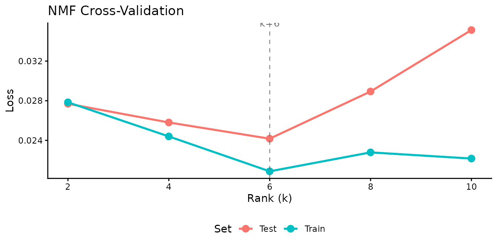

# Getting Started with RcppML

## What Is RcppML?

**RcppML** decomposes a nonnegative matrix $A$ into low-rank factors
$A \approx W \cdot \text{diag}(d) \cdot H$, where $W$ captures features,
$H$ captures sample loadings, and $d$ gives per-factor scale.

Built on Rcpp and Eigen with OpenMP parallelism and optional CUDA GPU
support, RcppML is designed for large sparse matrices common in
genomics, recommender systems, and image analysis. Key capabilities
include:

- **NMF** with coordinate-descent and Cholesky NNLS solvers
- **SVD / PCA** with optional non-negativity and L1 constraints
- **Cross-validation** via speckled holdout for automatic rank selection
- **Distribution-aware losses**: Gaussian, Poisson, Generalized Poisson,
  Negative Binomial, Gamma, Inverse Gaussian, Tweedie — plus
  zero-inflation
- **Regularization**: L1, L2, L21, angular, graph Laplacian, upper
  bounds
- **Consensus clustering** and divisive clustering (`dclust`)
- **Composable factorization graphs** via
  [`factor_net()`](https://zdebruine.github.io/RcppML/reference/factor_net.md)
- **StreamPress** `.spz` format for out-of-core computation
- **GPU acceleration** via CUDA

## Installation

Install from CRAN:

``` r
install.packages("RcppML")
```

Or install the development version:

``` r
remotes::install_github("zdebruine/RcppML")
```

For GPU support, see the [GPU
Acceleration](https://zdebruine.github.io/RcppML/articles/gpu-acceleration.md)
vignette.

## Quick NMF Demo

Generate a synthetic nonnegative matrix and recover its factors:

``` r
sim <- simulateNMF(200, 100, k = 5, noise = 0.3, seed = 42)
model <- nmf(sim$A, k = 5, seed = 1)
```

| Rows | Columns | Rank | Reconstruction MSE | Iterations | Runtime (sec) |
|-----:|--------:|-----:|-------------------:|-----------:|--------------:|
|  200 |     100 |    5 |             0.0173 |         21 |          0.24 |

NMF model summary

With a low-noise signal and the correct rank, NMF recovers the
generating factors and achieves near-zero reconstruction error.

## Quick SVD Demo

Compute a rank-5 truncated SVD of the AML chromatin-accessibility
dataset:

``` r
data(aml)
sv <- svd(aml, k = 5)
```

| Component | Variance Explained | Cumulative |
|----------:|:-------------------|:-----------|
|         1 | 91.9%              | 91.9%      |
|         2 | 1.7%               | 93.6%      |
|         3 | 0.7%               | 94.3%      |
|         4 | 0.5%               | 94.7%      |
|         5 | 0.3%               | 95.1%      |

Variance explained by the first 5 components

## Quick Cross-Validation Demo

Use speckled holdout cross-validation to find the best rank for the AML
data:

``` r
cv <- nmf(aml, k = c(2, 4, 6, 8, 10), test_fraction = 0.2, seed = 42, maxit = 50)
```



The test loss curve reveals the rank at which the model begins to
overfit. The minimum identifies the optimal number of factors for this
dataset.

## Built-in Datasets

RcppML ships seven datasets spanning diverse domains:

| Dataset       | Dimensions  | Type               | Domain                        |
|:--------------|:------------|:-------------------|:------------------------------|
| `aml`         | 824 × 135   | Dense matrix       | Chromatin accessibility (AML) |
| `golub`       | 38 × 5,000  | Sparse (dgCMatrix) | Gene expression (leukemia)    |
| `hawaiibirds` | 183 × 1,183 | Sparse (dgCMatrix) | Bird species counts           |
| `movielens`   | 3,867 × 610 | Sparse (dgCMatrix) | Movie ratings                 |
| `olivetti`    | 400 × 4,096 | Sparse (dgCMatrix) | Face images (Olivetti)        |
| `digits_full` | 1,797 × 64  | Sparse (dgCMatrix) | Handwritten digit images      |
| `pbmc3k`      | 8,000 × 500 | SPZ raw bytes      | Single-cell RNA-seq (PBMCs)   |

Shipped datasets

The `pbmc3k` dataset is stored as StreamPress-compressed raw bytes.
Decompress it with
[`st_read()`](https://zdebruine.github.io/RcppML/reference/st_read.md) —
see the
[StreamPress](https://zdebruine.github.io/RcppML/articles/streampress.md)
vignette.

## Where to Go Next

### Core Techniques

- [NMF
  Fundamentals](https://zdebruine.github.io/RcppML/articles/nmf-fundamentals.md)
  — Solvers, diagonal scaling, convergence, and basic workflow
- [SVD and PCA](https://zdebruine.github.io/RcppML/articles/svd-pca.md)
  — Truncated SVD, PCA, non-negative and sparse variants
- [Cross-Validation](https://zdebruine.github.io/RcppML/articles/cross-validation.md)
  — Speckled holdout for automatic rank selection
- [Statistical
  Distributions](https://zdebruine.github.io/RcppML/articles/distributions.md)
  — Distribution-aware losses and zero-inflation handling
- [Regularization and
  Constraints](https://zdebruine.github.io/RcppML/articles/regularization.md)
  — L1, L2, L21, angular penalties, and upper bounds

### Advanced Methods

- [Clustering, Consensus, and
  Classification](https://zdebruine.github.io/RcppML/articles/clustering.md)
  — Divisive clustering, consensus NMF, and sample classification
- [Factorization
  Graphs](https://zdebruine.github.io/RcppML/articles/factor-graphs.md)
  — Multi-modal and guided factorization via
  [`factor_net()`](https://zdebruine.github.io/RcppML/reference/factor_net.md)

### Applications

- [Image
  Decomposition](https://zdebruine.github.io/RcppML/articles/image-decomposition.md)
  — Learning visual parts from face and digit images
- [Recommendation
  Systems](https://zdebruine.github.io/RcppML/articles/recommendation-systems.md)
  — Building a movie recommender with sparse NMF

### Infrastructure

- [StreamPress](https://zdebruine.github.io/RcppML/articles/streampress.md)
  — High-performance sparse matrix compression and out-of-core NMF
- [GPU
  Acceleration](https://zdebruine.github.io/RcppML/articles/gpu-acceleration.md)
  — CUDA-based GPU support for large-scale factorization
