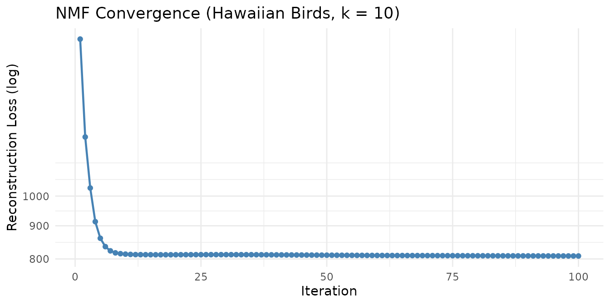
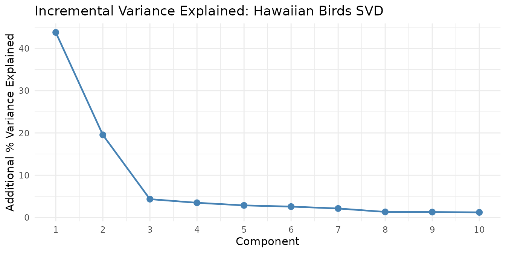

# Getting Started with RcppML

## What Is RcppML?

**RcppML** decomposes a nonnegative matrix $A$ into low-rank factors
$A \approx W \cdot \text{diag}(d) \cdot H$, where $W$ captures features,
$H$ captures sample loadings, and $d$ gives per-factor scale.

Built on Rcpp and Eigen with OpenMP parallelism and optional CUDA GPU
support, RcppML is designed for large sparse matrices common in
genomics, recommender systems, and image analysis. Key capabilities
include:

- **NMF** with coordinate-descent and Cholesky NNLS solvers
- **SVD / PCA** with optional non-negativity and L1 constraints
- **Cross-validation** via speckled holdout for automatic rank selection
- **Distribution-aware losses**: Gaussian, Poisson, Generalized Poisson,
  Negative Binomial, Gamma, Inverse Gaussian, Tweedie — plus
  zero-inflation
- **Regularization**: L1, L2, L21, angular, graph Laplacian, upper
  bounds
- **Consensus clustering** and divisive clustering (`dclust`)
- **Composable factorization graphs** via
  [`factor_net()`](https://zdebruine.github.io/RcppML/reference/factor_net.md)
- **StreamPress** `.spz` format for out-of-core computation
- **GPU acceleration** via CUDA

## Installation

Install from CRAN:

``` r
install.packages("RcppML")
```

Or install the development version:

``` r
remotes::install_github("zdebruine/RcppML")
```

For GPU support, see the [GPU
Acceleration](https://zdebruine.github.io/RcppML/articles/gpu-acceleration.md)
vignette.

## Quick NMF Demo

Factor the Hawaiian birds species-count matrix (183 species × 1,183 grid
cells) into 10 components:

``` r
data(hawaiibirds)
model <- nmf(hawaiibirds, k = 10, seed = 42, tol = 1e-5, maxit = 100)
```

| Rows | Columns | Rank | Reconstruction MSE | Iterations | Runtime (sec) |
|-----:|--------:|-----:|:-------------------|-----------:|--------------:|
|  183 |    1183 |   10 | 3.73e-03           |        100 |          0.28 |

NMF model summary

Each of the 10 factors captures a distinct pattern of bird species
co-occurrence across Hawaiian survey sites.



## Quick SVD Demo

We can also decompose the same data with SVD, which captures directions
of maximum variance rather than additive nonneg parts:

``` r
data(hawaiibirds)
sv <- svd(hawaiibirds, k = 10)
```



The first component captures the dominant species-composition gradient,
and each subsequent component adds progressively less explanatory power
— the hallmark of effective dimensionality reduction.

For PCA (centered and optionally scaled SVD), use the
[`pca()`](https://zdebruine.github.io/RcppML/reference/pca.md)
convenience wrapper:

``` r
pc <- pca(hawaiibirds, k = 5, seed = 42)  # center = TRUE by default
# Equivalent to: svd(hawaiibirds, k = 5, center = TRUE)
```

PCA centers the data before decomposition, so the first component
captures the dominant direction of variation rather than the overall
mean level. Use `scale = TRUE` for data where features have different
units or widely varying magnitude.

## Quick Cross-Validation Demo

Use speckled holdout cross-validation to find the best rank for the AML
data:

``` r
data(aml)
cv <- nmf(aml, k = c(2, 4, 6, 8, 10), test_fraction = 0.2, seed = 42)
```


Training loss always decreases with rank, but test loss reveals where
the model begins to overfit. The test-loss minimum identifies the
optimal number of factors.

## Built-in Datasets

RcppML ships seven datasets spanning diverse domains:

| Dataset       | Dimensions     | Type               | Domain                      |
|:--------------|:---------------|:-------------------|:----------------------------|
| `aml`         | 824 × 135      | Dense matrix       | DNA methylation (AML)       |
| `golub`       | 38 × 5,000     | Sparse (dgCMatrix) | Gene expression (leukemia)  |
| `hawaiibirds` | 183 × 1,183    | Sparse (dgCMatrix) | Bird species counts         |
| `movielens`   | 3,867 × 610    | Sparse (dgCMatrix) | Movie ratings               |
| `olivetti`    | 400 × 4,096    | Sparse (dgCMatrix) | Face images (Olivetti)      |
| `digits`      | 1,797 × 64     | Sparse (dgCMatrix) | Handwritten digit images    |
| `pbmc3k`      | 13,714 × 2,638 | SPZ raw bytes      | Single-cell RNA-seq (PBMCs) |

Shipped datasets

The `pbmc3k` dataset is stored as StreamPress-compressed raw bytes
containing the full **13,714 genes × 2,638 cells** from the 10x Genomics
PBMC 3k dataset, with 9 Seurat-annotated cell types embedded as column
metadata. Decompress it with
[`st_read()`](https://zdebruine.github.io/RcppML/reference/st_read.md)
and access annotations via
[`st_read_var()`](https://zdebruine.github.io/RcppML/reference/st_read_var.md)
— see the
[StreamPress](https://zdebruine.github.io/RcppML/articles/streampress.md)
vignette.

## Where to Go Next

### Core Techniques

- [NMF
  Fundamentals](https://zdebruine.github.io/RcppML/articles/nmf-fundamentals.md)
  — Solvers, diagonal scaling, convergence, and basic workflow
- [SVD and PCA](https://zdebruine.github.io/RcppML/articles/svd-pca.md)
  — Truncated SVD, PCA, non-negative and sparse variants
- [Cross-Validation](https://zdebruine.github.io/RcppML/articles/cross-validation.md)
  — Speckled holdout for automatic rank selection
- [Statistical
  Distributions](https://zdebruine.github.io/RcppML/articles/distributions.md)
  — Distribution-aware losses and zero-inflation handling
- [Regularization and
  Constraints](https://zdebruine.github.io/RcppML/articles/regularization.md)
  — L1, L2, L21, angular penalties, and upper bounds

### Advanced Methods

- [Clustering, Consensus, and
  Classification](https://zdebruine.github.io/RcppML/articles/clustering.md)
  — Divisive clustering, consensus NMF, and sample classification
- [Factorization
  Graphs](https://zdebruine.github.io/RcppML/articles/factor-graphs.md)
  — Multi-modal and guided factorization via
  [`factor_net()`](https://zdebruine.github.io/RcppML/reference/factor_net.md)

### Infrastructure

- [StreamPress](https://zdebruine.github.io/RcppML/articles/streampress.md)
  — High-performance sparse matrix compression and out-of-core NMF
- [GPU
  Acceleration](https://zdebruine.github.io/RcppML/articles/gpu-acceleration.md)
  — CUDA-based GPU support for large-scale factorization
