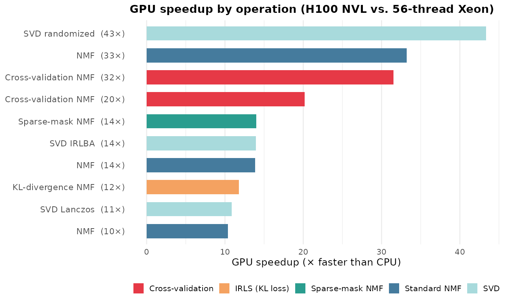

# GPU-Accelerated Computing

## Motivation

At scale, dimensionality reduction is bottlenecked by dense linear
algebra. Each NMF iteration computes Gram matrices ($HH^{T}$, $W^{T}W$)
and right-hand-side products ($AH^{T}$, $W^{T}A$) — operations that map
directly onto GPU hardware where thousands of cores execute matrix
multiplies in parallel. RcppML’s GPU backend uses NVIDIA CUDA with
cuBLAS and cuSPARSE to accelerate these operations, achieving **10–40×
speedups** on real single-cell datasets even against a fully-utilized
56-thread CPU.

The GPU advantage is not uniform across operations. Standard NMF already
benefits significantly, but **cross-validation and SVD randomized show
the largest gains** because these modes perform dense BLAS work (Gram
matrix corrections, block matrix multiplies) that maps directly onto GPU
hardware. The GPU is optional — all code falls back to CPU transparently
when CUDA is unavailable.

## Quick Start

``` r
library(RcppML)

# Check GPU availability
gpu_available()
#> [1] TRUE
gpu_info()
#>   device              name total_mb free_mb
#> 1      0  NVIDIA H100 NVL    95830   93500

# NMF with GPU — same API, add resource = "gpu"
model <- nmf(A, k = 20, resource = "gpu", seed = 42)
```

The `resource` parameter accepts `"gpu"`, `"cpu"`, or `"auto"`
(default). With `"auto"`, RcppML uses GPU when available and falls back
to CPU otherwise.

## Benchmarks on Real Data

How much faster is GPU in practice? We benchmarked 10 operations
spanning standard NMF, cross-validation, IRLS (KL divergence),
sparse-mask NMF, and SVD on two real single-cell RNA-seq datasets.

### Data Preparation

``` r
library(RcppML)
library(Matrix)
library(SeuratData)
library(Seurat)

# ── hcabm40k: 40,000 bone marrow cells ──
data("hcabm40k")
hca <- UpdateSeuratObject(hcabm40k)
counts <- hca[["RNA"]]$counts                    # 17,369 genes × 40,000 cells

# Select top 5,000 variable genes, log-normalize
gene_vars <- Matrix::rowMeans(counts^2) - Matrix::rowMeans(counts)^2
top5k <- head(order(gene_vars, decreasing = TRUE), 5000)
hca_5k <- counts[top5k, ]
lib_sizes <- Matrix::colSums(hca_5k)
hca_norm <- log1p(hca_5k %*% Diagonal(x = 1e4 / lib_sizes))
hca_norm <- as(hca_norm, "dgCMatrix")
# 5,000 × 40,000, nnz ≈ 33M, density ≈ 16.5%

# 10K-cell subset for expensive k = 64 operations
set.seed(42)
hca_10k <- hca_norm[, sample(ncol(hca_norm), 10000)]
# 5,000 × 10,000, nnz ≈ 8.3M

# ── pbmc3k: 500 PBMCs (bundled with RcppML) ──
data(pbmc3k, package = "RcppML")
tmp <- tempfile(fileext = ".spz")
writeBin(pbmc3k, tmp)
pbmc <- st_read(tmp)
pbmc_norm <- log1p(pbmc %*% Diagonal(x = 1e4 / Matrix::colSums(pbmc)))
pbmc_norm <- as(pbmc_norm, "dgCMatrix")
# 8,000 × 500, nnz ≈ 412K
```

### Results

All benchmarks ran on an **NVIDIA H100 NVL** (96 GB HBM3) against a
**56-thread Intel Xeon Gold 6238R** (2 × 28 cores, all threads active).
NMF iterations were forced with `tol = 0` and `maxit = 20`.

| Operation                              | CPU (s) | GPU (s) | Speedup |
|:---------------------------------------|--------:|--------:|--------:|
| SVD randomized (k=10, 40K cells)       |    17.8 |    0.41 |     43× |
| NMF (k=64, 10K cells)                  |    29.2 |    0.88 |     33× |
| Cross-validation NMF (k=64, 10K cells) |    75.3 |    2.39 |     32× |
| Cross-validation NMF (k=16, pbmc3k)    |     4.0 |    0.20 |     20× |
| Sparse-mask NMF (k=20, 10K cells)      |    10.5 |    0.75 |     14× |
| SVD IRLBA (k=10, 40K cells)            |     5.3 |    0.38 |     14× |
| NMF (k=20, 40K cells)                  |    38.5 |    2.78 |     14× |
| KL-divergence NMF (k=16, pbmc3k)       |    23.4 |    1.98 |     12× |
| SVD Lanczos (k=10, 40K cells)          |     4.8 |    0.44 |     11× |
| NMF (k=20, pbmc3k)                     |     2.2 |    0.21 |     10× |

CPU (56-thread Xeon) vs. GPU (H100 NVL) benchmarks



### Key Observations

Three patterns stand out:

1.  **SVD randomized shows the largest speedup** (43×). Randomized SVD
    performs full matrix–dense block multiplies ($AQ$, $A^{T}B$) that
    translate into a handful of cuSPARSE/cuBLAS calls on GPU.
    Cross-validation NMF at high rank is close behind (32×) because CV
    corrects the Gram matrix for every held-out entry each iteration — a
    $O\left( k^{2} \right)$ update per test-set column that batches
    naturally on GPU.

2.  **All operations achieve ≥ 10× speedup**, even against a
    fully-utilized 56-thread Xeon. NMF at high rank ($k = 64$, 33×),
    IRLS KL-divergence (12×), and sparse-mask NMF (14×) all benefit from
    GPU BLAS acceleration.

3.  **Speedups scale with problem size and rank**. The 40K-cell NMF at
    $k = 20$ (14×) benefits less than $k = 64$ on 10K cells (33×)
    because higher rank increases the Gram matrix and NNLS work that the
    GPU absorbs efficiently. With fewer CPU threads (e.g., 8), speedups
    increase proportionally.

## Why GPU Gains Are Larger for CV and IRLS

Standard NMF spends most of each iteration on two operations:

$$HH^{T}\quad(k \times k),\qquad AH^{T}\quad(m \times k)$$

Cross-validation adds a correction step: for each held-out column $j$ in
the test set, the Gram matrix is adjusted by subtracting the
contribution of the missing entries:

$$G_{j} = HH^{T} - \sum\limits_{i \in \text{mask}{(j)}}h_{i}h_{i}^{T}$$

On CPU, this per-column correction loop is sequential. On GPU, the
corrections for all test columns are batched into a single sparse
outer-product kernel. The result: CV overhead that dominates CPU time
becomes negligible on GPU, pushing CV speedups well above standard NMF
speedups.

IRLS losses (KL divergence, Gamma–Poisson, etc.) similarly increase
per-iteration work by solving weighted NNLS subproblems that require
additional Gram matrix updates with observation-specific weights —
again, heavy BLAS work that the GPU absorbs with minimal overhead.

## API Reference

### Resource Override Priority

The compute backend is determined by (highest priority first):

1.  `resource` parameter in
    [`nmf()`](https://zdebruine.github.io/RcppML/reference/nmf.md) or
    [`svd()`](https://zdebruine.github.io/RcppML/reference/svd.md)
2.  `RCPPML_RESOURCE` environment variable
3.  `options(RcppML.gpu = TRUE/FALSE)`
4.  Auto-detection (GPU if available, else CPU)

``` r
# Force CPU even when GPU is available
model <- nmf(A, k = 20, resource = "cpu", seed = 42)

# Session-wide override via environment variable
Sys.setenv(RCPPML_RESOURCE = "cpu")

# Or via R option
options(RcppML.gpu = FALSE)
```

### GPU-Supported Features

| Feature                     | GPU Support                           |
|:----------------------------|:--------------------------------------|
| Sparse NMF                  | Yes                                   |
| Dense NMF                   | Yes                                   |
| Cross-validation NMF        | Yes                                   |
| MSE loss                    | Yes                                   |
| MAE / Huber (via `robust`)  | Yes                                   |
| KL / distribution losses    | Yes                                   |
| L1, L2 regularization       | Yes                                   |
| L21, angular regularization | Yes                                   |
| Graph regularization        | CPU only                              |
| Upper bound constraints     | Yes                                   |
| Bipartition / dclust        | Yes                                   |
| StreamPress streaming NMF   | Yes (CPU decompression → GPU compute) |

When a GPU-unsupported feature is requested, RcppML falls back to CPU
automatically with no error.

### GPU-Direct StreamPress Reading

For very large datasets stored as `.spz` files,
[`st_read_gpu()`](https://zdebruine.github.io/RcppML/reference/st_read_gpu.md)
transfers the matrix directly into GPU memory, avoiding a full CPU-side
`dgCMatrix` copy:

``` r
gpu_handle <- st_read_gpu("large_dataset.spz")
model <- nmf(gpu_handle, k = 30, seed = 42)
st_free_gpu(gpu_handle)   # optional — GC handles cleanup
```

See the
[StreamPress](https://zdebruine.github.io/RcppML/articles/streampress.md)
vignette for `.spz` format details.

## Building the GPU Library

The GPU shared library is built separately from the R package using
`nvcc`.

### Requirements

- **NVIDIA GPU** with compute capability $\geq$ 7.0 (Volta or newer)
- **CUDA Toolkit** $\geq$ 12.x (cuBLAS and cuSPARSE included)

### Build Steps

``` bash
# 1. Load CUDA on your system
module load cuda/12.8.1   # HPC example

# 2. Build the GPU shared library (use the project Makefile)
cd RcppML/src/
make -f Makefile.gpu install

# Or manually:
nvcc -O3 \
  -gencode arch=compute_80,code=sm_80 \
  -gencode arch=compute_90,code=sm_90 \
  -std=c++17 -Xcompiler -fPIC --shared \
  -I../inst/include \
  -o ../inst/lib/RcppML_gpu.so \
  gpu_bridge_nmf.cu gpu_bridge_svd.cu gpu_bridge_cluster.cu \
  gpu_bridge_utils.cu sp_gpu_bridge.cu \
  -lcublas -lcusparse -lcuda

# 3. Verify
Rscript -e 'library(RcppML); cat("GPU:", gpu_available(), "\n")'
#> GPU: TRUE
```

Adapt the `-gencode` flags to your GPU architecture:

| GPU Family | Compute Capability |                       Flag |
|:-----------|:-------------------|---------------------------:|
| V100       | 7.0                | arch=compute_70,code=sm_70 |
| A100       | 8.0                | arch=compute_80,code=sm_80 |
| H100       | 9.0                | arch=compute_90,code=sm_90 |
| RTX 3090   | 8.6                | arch=compute_86,code=sm_86 |
| RTX 4090   | 8.9                | arch=compute_89,code=sm_89 |

CUDA architecture flags by GPU family

### Library Search Path

RcppML searches for `RcppML_gpu.so` in order: `inst/lib/` → `src/` →
package `lib/` → working directory root.

### GPU Memory

NMF GPU memory usage is approximately:

$$\text{Memory} \approx \text{nnz} \times 12 + (m + n) \times k \times 8{\mspace{6mu}\text{bytes}}$$

where nnz is the number of non-zeros, $m$ and $n$ are matrix dimensions,
and $k$ is rank. For a 30,000 × 20,000 matrix with 5% density at
$k = 30$, this is roughly 3.6 GB — well within a 32 GB GPU.

### HPC / SLURM Usage

``` bash
#!/bin/bash
#SBATCH --partition=gpu
#SBATCH --gres=gpu:1
#SBATCH --cpus-per-task=8
#SBATCH --mem=32G
#SBATCH --time=04:00:00

module load r/4.5.2 cuda/12.8.1
Rscript my_analysis.R
```

## Troubleshooting

**GPU not detected?**

``` r
gpu_available(force_recheck = TRUE)
#> [1] FALSE
```

Common causes: CUDA drivers missing or outdated (`nvidia-smi` to check),
GPU compute capability \< 7.0, `RcppML_gpu.so` not on the search path,
or architecture mismatch (library compiled for `sm_90` won’t load on a
V100).

**Precision**: GPU uses FP32 for core operations and FP64 selectively
for numerically sensitive accumulations. Results are equivalent to CPU
(FP64) within floating-point tolerance.

## Key Takeaways

1.  **Same API, different backend**: `resource = "gpu"` is the only
    change needed.
2.  **10–40× speedups** on real single-cell data against a
    fully-utilized 56-thread CPU, with SVD randomized and
    cross-validation showing the largest gains. With fewer CPU threads,
    speedups scale proportionally.
3.  **Automatic fallback**: If GPU is unavailable or a feature is
    CPU-only, RcppML falls back silently.
4.  **Direct disk-to-GPU** via
    [`st_read_gpu()`](https://zdebruine.github.io/RcppML/reference/st_read_gpu.md)
    for very large `.spz` datasets.

*See the [NMF
Fundamentals](https://zdebruine.github.io/RcppML/articles/nmf-fundamentals.md)
vignette for comprehensive parameter documentation and the
[StreamPress](https://zdebruine.github.io/RcppML/articles/streampress.md)
vignette for `.spz` file format details.*
