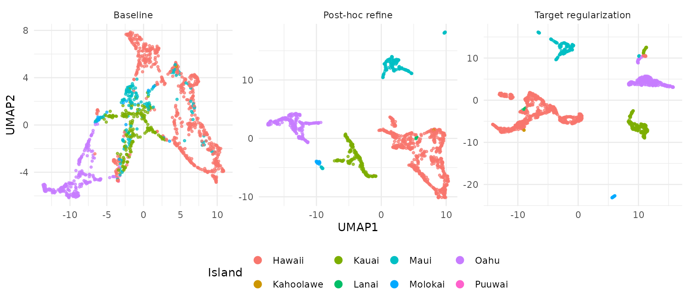
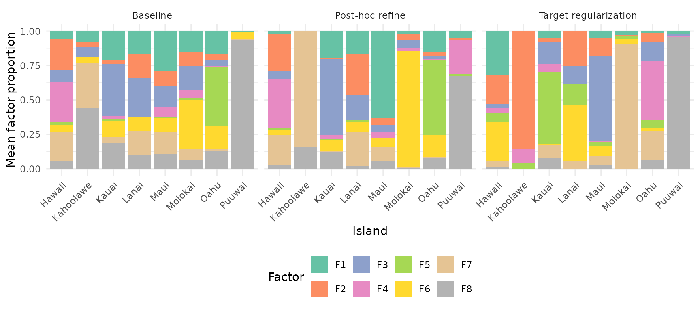
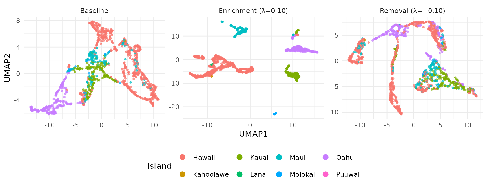
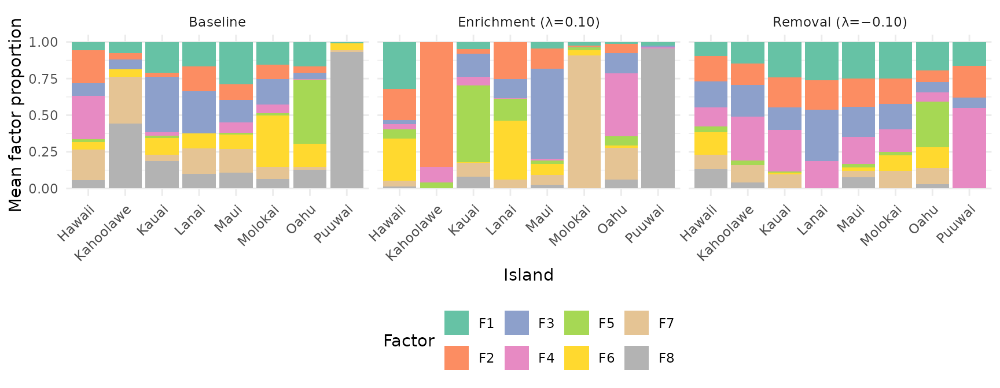

# Guided NMF: Label-Informed Factorization

## Motivation

NMF discovers latent structure from data alone — no labels needed. But
when you *have* class labels (cell types, tissue origins, experimental
conditions), you can steer the factorization to produce embeddings that
better separate known groups without collapsing all information toward
the centroids.

RcppML provides three complementary mechanisms:

1.  **Post-hoc refinement** via
    [`refine()`](https://zdebruine.github.io/RcppML/reference/refine.md)
    — correct an existing NMF embedding using label information
2.  **In-NMF target regularization** via
    [`compute_target()`](https://zdebruine.github.io/RcppML/reference/compute_target.md) +
    `target_H`/`target_lambda` parameters — bias the factorization
    toward (or away from) class-specific structure during optimization
3.  **Information removal** via negative `target_lambda` — suppress
    target-correlated structure using PROJ_ADV (Projected Adversarial
    Removal)

## Setup: Hawaii Birds Dataset

The `hawaiibirds` dataset contains bird species counts across 1,183
geographic grid cells on 8 Hawaiian islands. We’ll use the island of
origin as a class label.

``` r
data(hawaiibirds)
A <- hawaiibirds
meta <- attr(hawaiibirds, "metadata_h")
labels <- meta$island
cat("Data:", nrow(A), "species x", ncol(A), "grid cells,",
    nlevels(labels), "islands\n")
#> Data: 183 species x 1183 grid cells, 8 islands
```

## Step 1: Baseline NMF

First, run NMF with no label guidance:

``` r
set.seed(42)
model_base <- nmf(A, k = 8, tol = 1e-4, maxit = 100)
```

Evaluate the embedding using
[`assess()`](https://zdebruine.github.io/RcppML/reference/assess.md),
which computes clustering quality (NMI, ARI), classification accuracy
(KNN, logistic regression, random forest), and silhouette scores:

``` r
res_base <- assess(model_base, labels, classifiers = c("knn", "lr"))
cat("Baseline NMI:", round(res_base$metrics$nmi, 3), "\n")
#> Baseline NMI: 0.488
cat("Baseline ARI:", round(res_base$metrics$ari, 3), "\n")
#> Baseline ARI: 0.382
cat("Baseline KNN accuracy:", round(res_base$metrics$accuracy_knn, 3), "\n")
#> Baseline KNN accuracy: 0.898
```

## Step 2: Post-Hoc Refinement

[`refine()`](https://zdebruine.github.io/RcppML/reference/refine.md)
applies an OAS-ZCA whitened centroid correction to the existing
embedding. This shifts each sample toward its class centroid in a
decorrelated space, improving class separation without distorting the
overall structure.

Internally,
[`refine()`](https://zdebruine.github.io/RcppML/reference/refine.md)
Frobenius-normalizes the target to match the energy of H, so `lambda` is
interpretable as a fraction of H-energy added as correction:

``` r
model_refined <- refine(model_base, labels = labels, lambda = 0.5)
res_refined <- assess(model_refined, labels, classifiers = c("knn", "lr"))
cat("Refined NMI:", round(res_refined$metrics$nmi, 3), "\n")
#> Refined NMI: 0.827
cat("Refined ARI:", round(res_refined$metrics$ari, 3), "\n")
#> Refined ARI: 0.669
cat("Refined KNN accuracy:", round(res_refined$metrics$accuracy_knn, 3), "\n")
#> Refined KNN accuracy: 0.994
```

## Step 3: In-NMF Target Regularization

Instead of correcting after the fact, you can bias the NMF optimization
itself toward class-specific structure.
[`compute_target()`](https://zdebruine.github.io/RcppML/reference/compute_target.md)
builds a target matrix from labels, and `target_H`/`target_lambda`
inject it as a regularization term:

``` r
T_mat <- compute_target(model_base@h, labels)
set.seed(42)
model_target <- nmf(A, k = 8, tol = 1e-4, maxit = 100,
                    target_H = T_mat, target_lambda = 0.10)
res_target <- assess(model_target, labels, classifiers = c("knn", "lr"))
cat("Target reg NMI:", round(res_target$metrics$nmi, 3), "\n")
#> Target reg NMI: 0.846
cat("Target reg ARI:", round(res_target$metrics$ari, 3), "\n")
#> Target reg ARI: 0.663
cat("Target reg KNN accuracy:", round(res_target$metrics$accuracy_knn, 3), "\n")
#> Target reg KNN accuracy: 0.997
```

The target regularization modifies the NNLS subproblem by adding
$|\lambda| \cdot I$ to the Gram matrix diagonal and $\lambda \cdot T$ to
the right-hand side, gently pulling H toward the target structure at
every iteration. Note: `target_lambda` operates in the scale of the NNLS
system (Gram matrix), so small values (0.05–0.15) typically produce
large effects.

## Comparison

``` r
mse <- function(m) {
  resid <- as.matrix(A) - m@w %*% diag(m@d) %*% m@h
  mean(resid^2)
}
mse_base <- mse(model_base)
results <- data.frame(
  Method = c("Baseline", "Post-hoc refine (λ=0.5)",
             "Target regularization (λ=0.10)"),
  NMI = c(res_base$metrics$nmi, res_refined$metrics$nmi,
          res_target$metrics$nmi),
  ARI = c(res_base$metrics$ari, res_refined$metrics$ari,
          res_target$metrics$ari),
  KNN_acc = c(res_base$metrics$accuracy_knn, res_refined$metrics$accuracy_knn,
              res_target$metrics$accuracy_knn),
  MSE_ratio = c(1.0, mse(model_refined) / mse_base,
                mse(model_target) / mse_base)
)
results[, 2:4] <- round(results[, 2:4], 3)
results[, 5] <- round(results[, 5], 1)
knitr::kable(results, row.names = FALSE,
             col.names = c("Method", "NMI", "ARI", "KNN Accuracy",
                           "MSE ratio"))
```

| Method                         |   NMI |   ARI | KNN Accuracy | MSE ratio |
|:-------------------------------|------:|------:|-------------:|----------:|
| Baseline                       | 0.488 | 0.382 |        0.898 |       1.0 |
| Post-hoc refine (λ=0.5)        | 0.827 | 0.669 |        0.994 |       1.7 |
| Target regularization (λ=0.10) | 0.846 | 0.663 |        0.997 |       1.4 |

## Visualizing the Embeddings

### UMAP Projections

UMAPs of the H embeddings show how each method affects island
separation:

``` r
umap_df <- rbind(
  make_umap_df(model_base, labels, "Baseline"),
  make_umap_df(model_refined, labels, "Post-hoc refine"),
  make_umap_df(model_target, labels, "Target regularization")
)
umap_df$Method <- factor(umap_df$Method,
  levels = c("Baseline", "Post-hoc refine",
             "Target regularization"))

ggplot(umap_df, aes(UMAP1, UMAP2, color = Island)) +
  geom_point(size = 0.8, alpha = 0.7) +
  facet_wrap(~Method, scales = "free") +
  theme_minimal(base_size = 11) +
  theme(legend.position = "bottom") +
  guides(color = guide_legend(override.aes = list(size = 3, alpha = 1)))
```



The baseline embedding shows partial separation that improves with both
enrichment methods. Target regularization integrates label information
directly during optimization.

### Factor Composition by Island

How does each factor distribute across islands? Stacked bar plots reveal
whether factors are island-specific or shared. For each model, we
normalize H columns to unit sum, then average within each island:

``` r
make_bar_df <- function(model, labels, method) {
  H <- model@h
  # Normalize each column (sample) to proportions
  H_prop <- sweep(H, 2, colSums(H), "/")
  # Average proportions within each island
  islands <- levels(labels)
  k <- nrow(H)
  avg <- matrix(0, k, length(islands), dimnames = list(
    paste0("F", seq_len(k)), islands))
  for (i in seq_along(islands)) {
    idx <- labels == islands[i]
    avg[, i] <- rowMeans(H_prop[, idx, drop = FALSE])
  }
  df <- as.data.frame(as.table(avg))
  names(df) <- c("Factor", "Island", "Proportion")
  df$Method <- method
  df
}

bar_df <- rbind(
  make_bar_df(model_base, labels, "Baseline"),
  make_bar_df(model_refined, labels, "Post-hoc refine"),
  make_bar_df(model_target, labels, "Target regularization")
)
bar_df$Method <- factor(bar_df$Method,
  levels = c("Baseline", "Post-hoc refine",
             "Target regularization"))

ggplot(bar_df, aes(Island, Proportion, fill = Factor)) +
  geom_col(position = "stack") +
  facet_wrap(~Method) +
  theme_minimal(base_size = 11) +
  theme(axis.text.x = element_text(angle = 45, hjust = 1),
        legend.position = "bottom") +
  scale_fill_brewer(palette = "Set2") +
  labs(y = "Mean factor proportion")
```



In the baseline, factors are spread diffusely across islands. With
target regularization, each factor becomes more specific to one or a few
islands — the regularization encourages factor specialization.

## Guidance on Choosing a Method

| Method                 | When to use                   | Pros                         | Cons                     |
|------------------------|-------------------------------|------------------------------|--------------------------|
| `refine(lambda=0.5)`   | Quick post-hoc improvement    | Fast, no refit needed        | Only adjusts H, not W    |
| `target_lambda = 0.10` | Regularization during fitting | Integrated into optimization | Requires choosing lambda |

**Lambda tuning**: Start with `target_lambda = 0.10` for in-NMF
regularization, `lambda = 0.5` for post-hoc refinement. Values above
0.15 for in-NMF can saturate on strongly-structured data. Monitor the
MSE ratio (reconstruction cost / baseline): ratios above 3x suggest
over-regularization.

## Removing Label-Specific Information (Batch Removal)

Sometimes you want the *opposite*: an embedding that is invariant to a
known grouping variable. For instance, if island origin represents a
batch effect or confound, you may want factors that capture ecological
patterns *across* islands rather than island-specific ones.

RcppML uses **PROJ_ADV** (Projected Adversarial Removal) to suppress
target-correlated structure when `target_lambda` is negative. PROJ_ADV
modifies the NNLS Gram matrix to deflate directions aligned with the
target:

1.  Compute the target Gram matrix: $G_{T} = TT^{\top}/n$
2.  Trace-scale to match the reconstruction Gram:
    $\alpha = {tr}(G)/{tr}\left( G_{T} \right)$
3.  Subtract the scaled target Gram:
    $\widetilde{G} = G - |\lambda| \cdot \alpha \cdot G_{T}$
4.  Eigendecompose $\widetilde{G} = V\Lambda V^{\top}$ and clip negative
    eigenvalues to $\varepsilon = 10^{- 8}$
5.  Reconstruct:
    $\left. \widetilde{G}\leftarrow V\max(\Lambda,\varepsilon)V^{\top} \right.$

The trace-scaling in step 2 ensures $\lambda$ is interpretable as the
fraction of target energy to remove, regardless of the absolute scale of
G or $G_{T}$. The eigenvalue clipping in step 4 keeps the modified Gram
positive-definite, so directions most aligned with the target are
suppressed (their eigenvalues shrink or get clipped) while orthogonal
directions are preserved. The right-hand side (b) is not modified.

``` r
set.seed(42)
model_remove <- nmf(A, k = 8, tol = 1e-4, maxit = 100,
                    target_H = T_mat, target_lambda = -0.10)
res_remove <- assess(model_remove, labels, classifiers = c("knn", "lr"))
cat("Island-removed NMI:", round(res_remove$metrics$nmi, 3), "\n")
#> Island-removed NMI: 0.257
cat("Island-removed ARI:", round(res_remove$metrics$ari, 3), "\n")
#> Island-removed ARI: 0.156
cat("Island-removed KNN accuracy:", round(res_remove$metrics$accuracy_knn, 3), "\n")
#> Island-removed KNN accuracy: 0.829
cat("Island-removed MSE ratio:", round(mse(model_remove) / mse_base, 1), "x\n")
#> Island-removed MSE ratio: 3.6 x
```

### Comparing Enrichment vs Removal

``` r
results_all <- data.frame(
  Method = c("Baseline", "Target enrichment (\u03bb=0.10)",
             "Target removal (\u03bb=\u22120.10)"),
  NMI = c(res_base$metrics$nmi, res_target$metrics$nmi,
          res_remove$metrics$nmi),
  ARI = c(res_base$metrics$ari, res_target$metrics$ari,
          res_remove$metrics$ari),
  KNN_acc = c(res_base$metrics$accuracy_knn, res_target$metrics$accuracy_knn,
              res_remove$metrics$accuracy_knn),
  MSE_ratio = c(1.0, mse(model_target) / mse_base,
                mse(model_remove) / mse_base)
)
results_all[, 2:4] <- round(results_all[, 2:4], 3)
results_all[, 5] <- round(results_all[, 5], 1)
knitr::kable(results_all, row.names = FALSE,
             col.names = c("Method", "NMI", "ARI", "KNN Accuracy",
                           "MSE ratio"))
```

| Method                     |   NMI |   ARI | KNN Accuracy | MSE ratio |
|:---------------------------|------:|------:|-------------:|----------:|
| Baseline                   | 0.488 | 0.382 |        0.898 |       1.0 |
| Target enrichment (λ=0.10) | 0.846 | 0.663 |        0.997 |       1.4 |
| Target removal (λ=−0.10)   | 0.257 | 0.156 |        0.829 |       3.6 |

### UMAP: Enrichment vs Removal

``` r
umap_remove_df <- rbind(
  make_umap_df(model_base, labels, "Baseline"),
  make_umap_df(model_target, labels, "Enrichment (λ=0.10)"),
  make_umap_df(model_remove, labels, "Removal (λ=−0.10)")
)
umap_remove_df$Method <- factor(umap_remove_df$Method,
  levels = c("Baseline", "Enrichment (λ=0.10)", "Removal (λ=−0.10)"))

ggplot(umap_remove_df, aes(UMAP1, UMAP2, color = Island)) +
  geom_point(size = 0.8, alpha = 0.7) +
  facet_wrap(~Method, scales = "free") +
  theme_minimal(base_size = 11) +
  theme(legend.position = "bottom") +
  guides(color = guide_legend(override.aes = list(size = 3, alpha = 1)))
```



Enrichment sharpens island clusters; removal mixes them together. The
remaining structure in the removal UMAP reflects ecological signal that
is not explained by island identity (e.g., elevation, habitat type, or
shared species assemblages).

### Factor Composition: Enrichment vs Removal

``` r
bar_remove_df <- rbind(
  make_bar_df(model_base, labels, "Baseline"),
  make_bar_df(model_target, labels, "Enrichment (λ=0.10)"),
  make_bar_df(model_remove, labels, "Removal (λ=−0.10)")
)
bar_remove_df$Method <- factor(bar_remove_df$Method,
  levels = c("Baseline", "Enrichment (λ=0.10)", "Removal (λ=−0.10)"))

ggplot(bar_remove_df, aes(Island, Proportion, fill = Factor)) +
  geom_col(position = "stack") +
  facet_wrap(~Method) +
  theme_minimal(base_size = 11) +
  theme(axis.text.x = element_text(angle = 45, hjust = 1),
        legend.position = "bottom") +
  scale_fill_brewer(palette = "Set2") +
  labs(y = "Mean factor proportion")
```



With negative lambda, PROJ_ADV suppresses target-correlated directions
in the Gram matrix. Factors become more uniformly distributed across
islands — each factor captures cross-island patterns rather than
island-specific signal. This is useful for:

- **Batch correction**: Removing batch-specific variation while
  preserving biological signal
- **Confound removal**: Factoring out known confounders (e.g.,
  sequencing depth, donor effects)
- **Integration**: Creating a shared embedding across experimental
  conditions

## Integration with Factor Graphs

Target regularization works with the factor graph API via
[`W()`](https://zdebruine.github.io/RcppML/reference/W.md) and
[`H()`](https://zdebruine.github.io/RcppML/reference/W.md) per-factor
configs:

``` r
T_mat <- compute_target(model_base@h, labels)

# Enrichment
net_enrich <- factor_input(A) |>
  nmf_layer(k = 8, H = H(target = T_mat, target_lambda = 0.10)) |>
  factor_net()

# Removal
net_remove <- factor_input(A) |>
  nmf_layer(k = 8, H = H(target = T_mat, target_lambda = -0.10)) |>
  factor_net()
```
