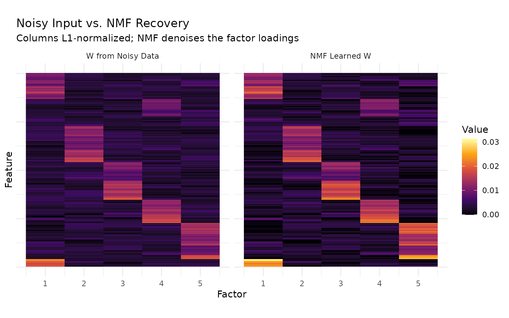
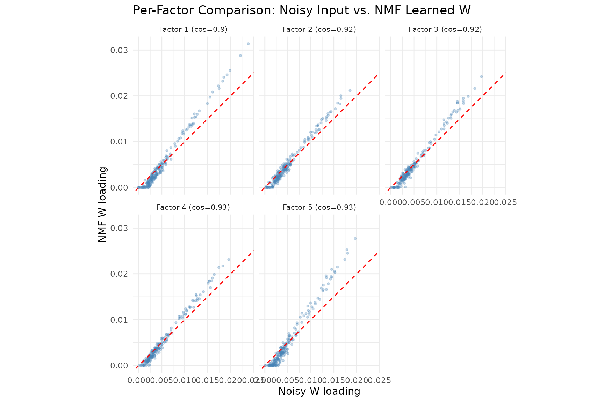
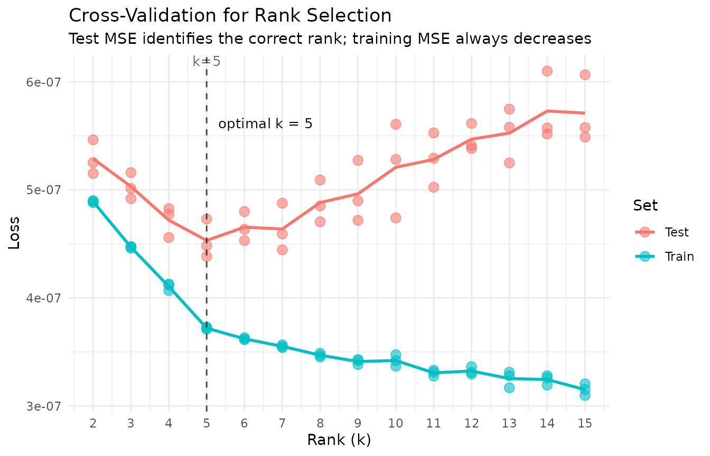
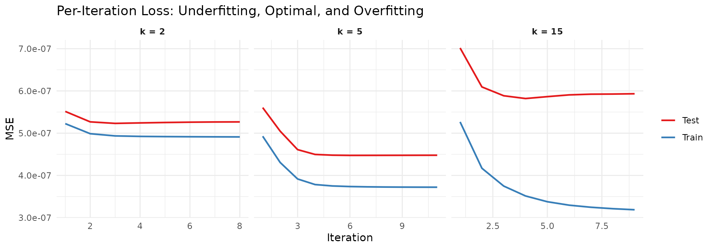
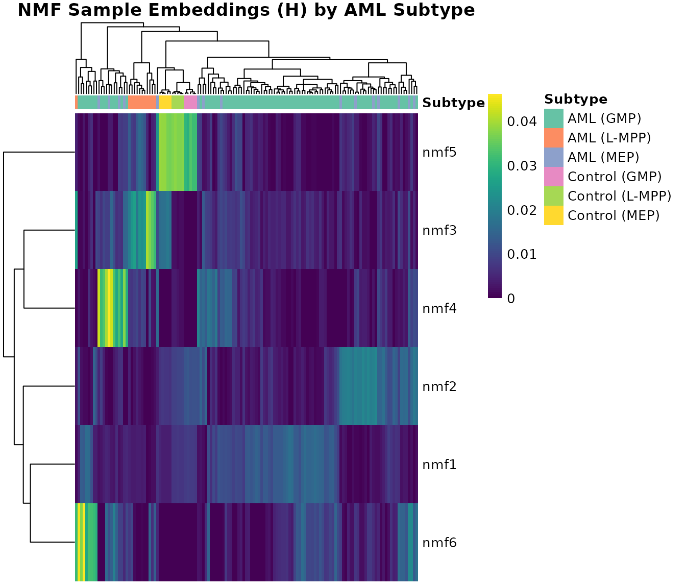
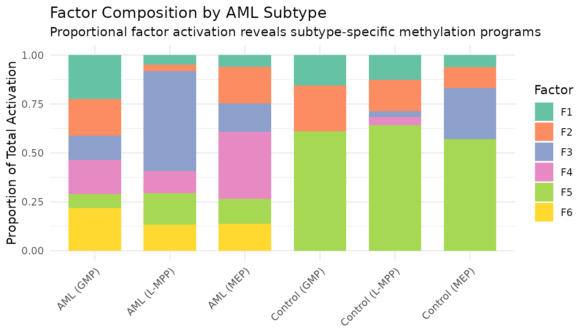
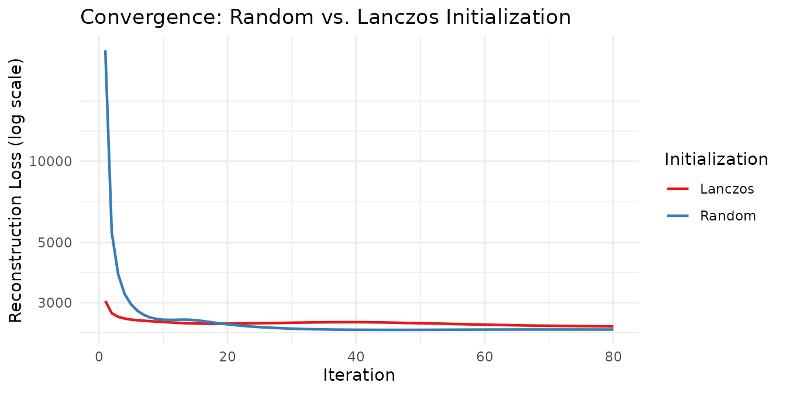

# NMF Fundamentals

## Motivation

How can we decompose a nonnegative matrix into interpretable parts?
Non-negative Matrix Factorization (NMF) answers this by finding
additive, parts-based representations: each factor captures a distinct
pattern, and all weights are nonneg, so factors combine constructively.
Unlike PCA, where components can cancel each other out, NMF factors are
always additive — making them directly interpretable as “parts” of the
data.

NMF is widely used in topic modeling, image decomposition, gene
expression analysis, and recommendation systems. RcppML provides a
high-performance implementation with a distinctive
$A \approx W \cdot \text{diag}(d) \cdot H$ factorization, where the
diagonal scaling $d$ makes factors comparable and ordered by importance.

## API Reference

### The `nmf()` Function

``` r
nmf(data, k, tol = 1e-4, maxit = 100, seed = NULL,
    L1 = c(0, 0), L2 = c(0, 0),
    mask = NULL, loss = "mse",
    nonneg = c(TRUE, TRUE),
    verbose = FALSE, ...)
```

Key parameters:

| Parameter | Type                   | Default       | Description                                                                                                    |
|-----------|------------------------|---------------|----------------------------------------------------------------------------------------------------------------|
| `data`    | matrix/dgCMatrix       | —             | Nonneg input matrix (features × samples)                                                                       |
| `k`       | integer                | —             | Factorization rank (number of factors)                                                                         |
| `tol`     | numeric                | 1e-4          | Convergence tolerance (correlation-distance)                                                                   |
| `maxit`   | integer                | 100           | Maximum iterations                                                                                             |
| `seed`    | int/matrix/string      | NULL          | Random seed, init matrix, or method (“lanczos”, “irlba”)                                                       |
| `mask`    | NULL/“zeros”/dgCMatrix | NULL          | Observation mask for fitting                                                                                   |
| `loss`    | character              | “mse”         | Loss function: “mse” or distribution-based (see [`?nmf`](https://zdebruine.github.io/RcppML/reference/nmf.md)) |
| `nonneg`  | logical(2)             | c(TRUE, TRUE) | Non-negativity constraints on W and H                                                                          |

Advanced parameters passed via `...`:

| Parameter      | Default | Description                                      |
|----------------|---------|--------------------------------------------------|
| `norm`         | “L1”    | Factor normalization: “L1”, “L2”, or “none”      |
| `sort_model`   | TRUE    | Sort factors by decreasing $d$                   |
| `threads`      | 0       | Number of OpenMP threads (0 = auto)              |
| `on_iteration` | NULL    | Callback receiving (iter, train_loss, test_loss) |

Initialization options (passed via `seed`):

| Method            | Description                                                                   |
|-------------------|-------------------------------------------------------------------------------|
| `NULL` or integer | Random nonneg initialization (default). May need more iterations to converge. |
| `"lanczos"`       | SVD-based warm start via Lanczos iteration. Often converges faster.           |
| `"irlba"`         | SVD-based warm start via IRLBA. Memory-efficient for large sparse matrices.   |
| matrix            | User-supplied W initialization matrix.                                        |

Normalization options:

| Method   | Description                                                          |
|----------|----------------------------------------------------------------------|
| `"L1"`   | Columns of W and rows of H sum to 1 (default). Scales stored in $d$. |
| `"L2"`   | Unit L2 norm for columns of W and rows of H.                         |
| `"none"` | No normalization; $d$ is all ones.                                   |

> **Normalization and regularization interaction**: L1 regularization is
> applied *after* normalization at each iteration. With `norm = "L1"`,
> factor columns are rescaled to sum to 1 before L1 soft-thresholding.
> This means the effective penalty depends on the normalization mode;
> the same L1 value produces different sparsity levels under L1 vs. L2
> normalization. Start with `norm = "L1"` (default) when using L1
> regularization.

### Factor Extraction and Inspection

The [`nmf()`](https://zdebruine.github.io/RcppML/reference/nmf.md)
function returns an S4 object of class `nmf` with slots accessed via
`$`:

- `model@w` or `model$w` — $m \times k$ feature loading matrix (W)
- `model@h` or `model$h` — $k \times n$ sample embedding matrix (H)
- `model@d` or `model$d` — length-$k$ diagonal scaling vector
- `model@misc` — metadata list (iterations, runtime, loss, etc.)
- `dim(model)` — returns `c(m, n, k)`
- `head(model, n)` — first $n$ factors
- `model[i]` — subset to specific factor indices

The canonical S4 accessor is `@` (e.g., `model@w`). The `$` shorthand
also works due to method dispatch.

### Reconstruction and Loss

- `prod(model)` — reconstructs $W \cdot \text{diag}(d) \cdot H$ (dense
  matrix)
- `evaluate(model, data)` — reconstruction loss (**defaults to MSE**
  regardless of what loss was used for fitting; specify
  `evaluate(model, data, loss = "gp")` to compute loss with the same
  distribution used for fitting)
- `mse(model$w, model$d, model$h, data)` — standalone MSE computation

### Model Comparison

- `align(model, ref)` — reorder factors to match a reference model
  (Hungarian algorithm)
- `sparsity(model)` — fraction of near-zero entries in W and H
- `cosine(x, y)` — column-wise cosine similarity between matrices
- `bipartiteMatch(cost_matrix)` — Hungarian algorithm for optimal factor
  pairing (returns 0-indexed `$assignment`)

### Convergence Control

- `tol` controls the convergence threshold. The model converges when the
  maximum change in any factor (measured by correlation distance) falls
  below `tol`.
- `maxit` provides a hard iteration cap.
- `on_iteration` accepts a callback
  `function(iter, train_loss, test_loss)` called after each iteration.

## Theory and Algorithms

### Objective

NMF solves the constrained optimization problem:

$$\min\limits_{W \geq 0,\, H \geq 0} \parallel A - W \cdot \text{diag}(d) \cdot H \parallel_{F}^{2}$$

where $A$ is an $m \times n$ nonneg matrix, $W$ is $m \times k$, $H$ is
$k \times n$, and $d$ is a length-$k$ scaling vector.

### Alternating NNLS

RcppML uses alternating non-negative least squares: fix H, solve for W;
fix W, solve for H. After each full iteration, columns of W and rows of
H are normalized and the scales absorbed into $d$. This diagonal scaling
makes factors directly comparable and ordered by importance when
`sort_model = TRUE`.

### Initialization

Random initialization gives a noisy starting point that may require more
iterations. SVD-based methods (Lanczos, IRLBA) compute a truncated SVD
as a warm start, typically converging faster — especially for
well-conditioned data.

### Non-uniqueness

NMF solutions are not unique: different seeds lead to different local
optima. Always set `seed` for reproducibility. For robust factorizations
across multiple random starts, use
[`consensus_nmf()`](https://zdebruine.github.io/RcppML/reference/consensus_nmf.md)
(see the
[Clustering](https://zdebruine.github.io/RcppML/articles/clustering.md)
vignette).

### Projective NMF

In standard NMF, both W and H are solved independently in alternating
updates. **Projective NMF** adds a structural constraint: instead of
solving for H, it is computed as a linear projection of the data through
W:

$$H = \text{diag}(d) \cdot W^{T} \cdot A$$

This means H is entirely determined by W — there are no free parameters
in H. Enable it with `projective = TRUE`:

``` r
model <- nmf(data, k = 6, projective = TRUE)
```

**Why use projective NMF?**

- **More orthogonal features**: The projection constraint forces W
  columns to be nearly orthogonal, because the only way to minimize
  reconstruction error when $H = W^{T}A$ is for the columns of W to
  capture non-overlapping parts of the data.
- **Fewer degrees of freedom**: Since H is determined by W, the model
  has roughly half as many free parameters, acting as an implicit
  regularizer.
- **Unique H for a given W**: Eliminates one source of non-uniqueness in
  the factorization.

The tradeoff is higher reconstruction error — the model is more
constrained, so it cannot fit the data as closely. Projective NMF is
most useful when you want clearly separable, non-overlapping factors for
interpretability rather than minimum reconstruction error.

``` r
data(aml)
m_std  <- nmf(aml, k = 6, seed = 42, tol = 1e-5)
m_proj <- nmf(aml, k = 6, seed = 42, tol = 1e-5, projective = TRUE)

# Orthogonality: mean absolute off-diagonal cosine between W columns
# (lower = more orthogonal)
ortho_metric <- function(mat) {
  cs <- cosine(mat, mat)
  diag(cs) <- 0
  mean(abs(cs))
}

knitr::kable(data.frame(
  Mode = c("Standard", "Projective"),
  `W orthogonality` = round(c(ortho_metric(m_std@w), ortho_metric(m_proj@w)), 3),
  `W mean sparsity` = round(c(mean(sparsity(m_std)$sparsity[1:6]),
                               mean(sparsity(m_proj)$sparsity[1:6])), 3),
  `Reconstruction MSE` = format(c(evaluate(m_std, aml), evaluate(m_proj, aml)),
                                 digits = 3, scientific = TRUE),
  check.names = FALSE
), caption = "Standard vs. projective NMF on AML data (k = 6). Lower W orthogonality = more independent factors.")
```

| Mode       | W orthogonality | W mean sparsity | Reconstruction MSE |
|:-----------|----------------:|----------------:|:-------------------|
| Standard   |           0.583 |           0.082 | 2.15e-02           |
| Projective |           0.188 |           0.454 | 4.13e-01           |

Standard vs. projective NMF on AML data (k = 6). Lower W orthogonality =
more independent factors.

Projective NMF yields W columns that are substantially more orthogonal
(lower off-diagonal cosine), making each factor correspond to a more
distinct set of features. This comes at the cost of reconstruction
fidelity — the projection constraint prevents the model from fitting the
data as tightly.

> **Note**: `projective = TRUE` and `symmetric = TRUE` cannot be
> combined. For symmetric matrices ($A = A^{T}$), symmetric NMF enforces
> $H = W^{T}$ directly.

## Worked Examples

### Example 1: Recovering Known Factors from Synthetic Data

We generate a synthetic matrix with 5 true factors and test whether NMF
can recover them.

``` r
sim <- simulateNMF(200, 80, k = 5, noise = 3.0, seed = 42)
model <- nmf(sim$A, k = 5, seed = 1, tol = 1e-5, maxit = 100)
```

To compare learned factors with ground truth, we compute cosine
similarity between each pair of W columns. The
[`bipartiteMatch()`](https://zdebruine.github.io/RcppML/reference/bipartiteMatch.md)
function finds the optimal one-to-one assignment (note: it returns
0-indexed assignments):

``` r
sim_cos <- cosine(model$w, sim$w)
match_result <- bipartiteMatch(1 - sim_cos + 1e-10)
assignment <- match_result$assignment + 1L  # convert to 1-indexed

per_factor_cos <- sapply(seq_len(5), function(i) {
  sim_cos[i, assignment[i]]
})

knitr::kable(
  data.frame(
    Factor = 1:5,
    `Cosine Similarity` = round(per_factor_cos, 4),
    check.names = FALSE
  ),
  caption = "Per-factor cosine similarity between learned and true W columns."
)
```

| Factor | Cosine Similarity |
|-------:|------------------:|
|      1 |            0.9040 |
|      2 |            0.9207 |
|      3 |            0.9178 |
|      4 |            0.9327 |
|      5 |            0.9271 |

Per-factor cosine similarity between learned and true W columns.

Factor recovery quality depends on the signal-to-noise ratio, matrix
size, and the degree of overlap between true factors. Here we use
`noise = 3.0`, meaning the noise amplitude is three times the signal — a
challenging setting. Despite this, NMF recovers all five factors with
high cosine similarity, demonstrating robustness to additive noise.

``` r
# Align learned W to true W using bipartite matching
learned_w <- model$w

# Compute noisy W: least-squares projection of A onto true H (shows noise corruption)
noisy_w <- as.matrix(sim$A %*% t(sim$h) %*% solve(sim$h %*% t(sim$h)))
noisy_w <- noisy_w[, assignment]

# L1-normalize columns so both heatmaps share the same [0, 1] scale
l1_norm <- function(mat) sweep(mat, 2, colSums(abs(mat)), "/")
noisy_w   <- l1_norm(noisy_w)
learned_w <- l1_norm(learned_w)

# Hierarchical clustering on the combined matrix for consistent row/col order
combined_w <- cbind(noisy_w, learned_w)
row_hc <- hclust(dist(combined_w))
row_ord <- row_hc$order
col_hc <- hclust(dist(t(noisy_w)))
col_ord <- col_hc$order

noisy_w <- noisy_w[row_ord, col_ord]
learned_w <- learned_w[row_ord, col_ord]

# Build long-format data for ggplot
make_heatmap_df <- function(mat, label) {
  df <- expand.grid(Feature = seq_len(nrow(mat)), Factor = seq_len(ncol(mat)))
  df$Value <- as.vector(mat)
  df$Source <- label
  df
}
hm_df <- rbind(
  make_heatmap_df(noisy_w, "W from Noisy Data"),
  make_heatmap_df(learned_w, "NMF Learned W")
)
hm_df$Source <- factor(hm_df$Source, levels = c("W from Noisy Data", "NMF Learned W"))

ggplot(hm_df, aes(x = Factor, y = Feature, fill = Value)) +
  geom_raster() +
  facet_wrap(~Source) +
  scale_fill_viridis_c(option = "inferno") +
  labs(title = "Noisy Input vs. NMF Recovery",
       subtitle = "Columns L1-normalized; NMF denoises the factor loadings",
       x = "Factor", y = "Feature") +
  theme_minimal() +
  theme(aspect.ratio = 1,
        axis.text.y = element_blank(), axis.ticks.y = element_blank())
```



The left panel shows the factor loadings recovered by projecting the
noisy data matrix onto the true H — the noise substantially degrades the
block structure. The right panel shows NMF’s learned W, where
block-diagonal structure is clearly recovered. NMF acts as a denoiser:
by jointly optimizing W and H, it separates signal from noise more
effectively than direct projection.

``` r
# Per-factor scatter plots: noisy vs. learned W column values
scatter_df <- do.call(rbind, lapply(1:5, function(i) {
  data.frame(
    Noisy = noisy_w[, i],
    Learned = learned_w[, i],
    Factor = paste0("Factor ", i, " (cos=", round(per_factor_cos[i], 2), ")")
  )
}))

ggplot(scatter_df, aes(x = Noisy, y = Learned)) +
  geom_point(alpha = 0.3, size = 0.8, color = "steelblue") +
  geom_abline(slope = 1, intercept = 0, linetype = "dashed", color = "red") +
  facet_wrap(~ Factor, nrow = 2) +
  coord_fixed() +
  labs(title = "Per-Factor Comparison: Noisy Input vs. NMF Learned W",
       x = "Noisy W loading", y = "NMF W loading") +
  theme_minimal() +
  theme(strip.text = element_text(size = 8))
```



The scatter plots compare noisy input loadings (x-axis) to NMF-recovered
loadings (y-axis) for each factor. NMF sharpens the loadings — points
are pulled toward the axes, reflecting the non-negativity constraint’s
tendency to suppress noise and produce sparser, more interpretable
factors. The cosine similarity in each panel title measures agreement
with the true (clean) factors.

### Example 2: Choosing Rank with Cross-Validation

In Example 1, we knew the true rank $k = 5$ because we generated the
data. In practice, the correct rank is unknown. **Cross-validation**
provides a principled answer: hold out a random fraction of matrix
entries, fit NMF on the remainder, and measure prediction error on the
held-out set. The rank that minimizes test error is the best choice.

``` r
cv <- nmf(sim$A, k = 2:15, test_fraction = 0.05, cv_seed = 1:3,
          tol = 1e-5, maxit = 200)
agg <- aggregate(test_mse ~ k, data = cv, FUN = mean)
best_k <- agg$k[which.min(agg$test_mse)]
```

``` r
plot(cv) +
  geom_vline(xintercept = best_k, linetype = "dashed", alpha = 0.5) +
  annotate("text", x = best_k + 0.3, y = max(agg$test_mse) * 0.98,
           label = paste("optimal k =", best_k), hjust = 0, size = 3.5) +
  labs(
    title = "Cross-Validation for Rank Selection",
    subtitle = "Test MSE identifies the correct rank; training MSE always decreases"
  ) +
  theme_minimal()
```



The plot reveals the classic **bias–variance tradeoff**:

- **Underfitting** ($k < 5$): Both training and test MSE are high. The
  model lacks capacity to capture all five true factors, so it cannot
  represent the data’s structure and performs poorly on both seen and
  unseen entries.
- **Optimal rank** ($k = 5$): Test MSE reaches its minimum. The model
  has exactly enough factors to capture the true structure without
  fitting noise.
- **Overfitting** ($k > 5$): Training MSE continues to decrease — the
  model fits the training entries ever more closely — but test MSE
  *increases*. Extra factors fit noise in the training set that does not
  generalize to held-out entries.

> **How it works:** `nmf(data, k = 1:15, test_fraction = 0.2)` randomly
> masks 20% of matrix entries before fitting. At each iteration the
> model is trained only on the visible 80%; the masked entries are
> predicted from the current $W \cdot \text{diag}(d) \cdot H$ and scored
> against their true values. The rank with the lowest test MSE is
> selected.

#### Per-Iteration Convergence: Underfitting vs. Overfitting

The cross-rank plot above shows *which* $k$ is best. Now we look
*inside* individual fits to see how training and test loss evolve
iteration by iteration. This reveals the dynamics of overfitting in real
time.

``` r
iter_data <- do.call(rbind, lapply(c(2, 5, 15), function(k) {
  m <- nmf(sim$A, k = k, seed = 1, tol = 1e-10, maxit = 100, test_fraction = 0.05, resource = "cpu")
  n <- length(m@misc$loss_history)
  data.frame(
    Iteration = rep(1:n, 2),
    MSE = c(m@misc$loss_history, m@misc$test_loss_history),
    Set = rep(c("Train", "Test"), each = n),
    Rank = factor(paste0("k = ", k), levels = paste0("k = ", c(2, 5, 15)))
  )
}))
```

``` r
ggplot(iter_data, aes(x = Iteration, y = MSE, color = Set)) +
  geom_line(linewidth = 0.8) +
  facet_wrap(~ Rank, scales = "free_x") +
  scale_color_manual(values = c("Train" = "#377EB8", "Test" = "#E41A1C")) +
  scale_y_continuous(labels = function(x) sprintf("%.1e", x)) +
  labs(
    title = "Per-Iteration Loss: Underfitting, Optimal, and Overfitting",
    x = "Iteration", y = "MSE", color = NULL
  ) +
  theme_minimal() +
  theme(strip.text = element_text(face = "bold"))
```



Three distinct behaviors emerge:

- **k = 2 (underfitting):** Both training and test loss decrease
  smoothly and converge together. However, they plateau at a level well
  above the optimal test error — the model simply cannot represent all
  five factors with only two components.
- **k = 5 (optimal):** Both losses decrease rapidly and converge near
  the lowest achievable test error. Training and test losses track each
  other closely, indicating the model generalizes well.
- **k = 15 (overfitting):** Training loss continues to fall, but test
  loss reaches a minimum early and then *increases* as the model
  iterates further. The excess factors memorize training-set noise at
  the expense of held-out prediction.

The combination of the cross-rank plot (which $k$ to choose) and the
per-iteration traces (why that choice matters) provides a complete
picture of rank selection in NMF.

### Example 3: Methylation Factor Interpretation (AML Data)

The `aml` dataset contains 824 differentially methylated regions (DMRs)
× 135 samples from an Acute Myeloid Leukemia study. Features are genomic
coordinate ranges (e.g., `chr1:847816-848609`) representing CpG-dense
regions with methylation beta values. Sample subtypes are stored in
`attr(aml, "metadata_h")$category`.

``` r
data(aml)
meta <- attr(aml, "metadata_h")
model_aml <- nmf(aml, k = 6, seed = 42, tol = 1e-5)
```

Since AML features are genomic coordinate ranges (e.g.,
`chr1:847816-848609`) rather than gene names, a table of top loadings
per factor is not directly interpretable without external annotation
databases. Instead, we visualize the H matrix (sample embeddings) —
where the factor structure maps directly to AML subtypes — using
`pheatmap`, which handles clustering and annotation alignment
automatically:

``` r
library(pheatmap)

H <- model_aml$h
subtypes <- meta$category

# pheatmap needs unique column identifiers for annotation mapping
colnames(H) <- paste0("S", seq_len(ncol(H)))
anno_col <- data.frame(Subtype = subtypes, row.names = colnames(H))

# Define subtype colors
subtype_levels <- sort(unique(subtypes))
subtype_colors <- setNames(
  RColorBrewer::brewer.pal(max(3, length(subtype_levels)), "Set2")[seq_along(subtype_levels)],
  subtype_levels
)

pheatmap(H,
         annotation_col = anno_col,
         annotation_colors = list(Subtype = subtype_colors),
         cluster_cols = TRUE,
         cluster_rows = TRUE,
         show_colnames = FALSE,
         color = viridis::viridis(100),
         main = "NMF Sample Embeddings (H) by AML Subtype",
         fontsize = 10)
```



The H heatmap reveals clear subtype structure: `pheatmap` hierarchically
clusters both rows (factors) and columns (samples), then aligns the
subtype annotation bar with the clustered column order automatically.
Certain factors activate preferentially within specific AML subtypes,
indicating that NMF captures biologically meaningful methylation
programs.

``` r
# Stacked bar chart: mean factor activation by subtype
H <- model_aml$h
subtypes <- meta$category

mean_H <- sapply(unique(subtypes), function(s) {
  rowMeans(H[, subtypes == s, drop = FALSE])
})
colnames(mean_H) <- unique(subtypes)

bar_df <- do.call(rbind, lapply(colnames(mean_H), function(s) {
  data.frame(Subtype = s, Factor = paste0("F", 1:nrow(mean_H)),
             Activation = mean_H[, s])
}))

ggplot(bar_df, aes(x = Subtype, y = Activation, fill = Factor)) +
  geom_col(position = "fill", width = 0.7) +
  scale_fill_brewer(palette = "Set2") +
  labs(title = "Factor Composition by AML Subtype",
       subtitle = "Proportional factor activation reveals subtype-specific methylation programs",
       y = "Proportion of Total Activation", x = NULL) +
  theme_minimal() +
  theme(axis.text.x = element_text(angle = 45, hjust = 1))
```



The stacked bar chart provides a complementary view to the heatmap: each
subtype’s bar shows the relative contribution of each factor, making
subtype-specific factor dominance immediately visible.

### Example 4: Convergence and Initialization Comparison

We compare random vs. Lanczos initialization by tracking loss per
iteration using the `on_iteration` callback:

``` r
# Track loss over iterations via callback
track_loss <- function() {
  losses <- numeric(0)
  callback <- function(iter, train_loss, test_loss) {
    losses[iter] <<- train_loss
  }
  list(callback = callback, get = function() losses)
}

tracker_random <- track_loss()
model_random <- nmf(aml, k = 6, seed = 42, tol = 1e-6,
                    maxit = 80, on_iteration = tracker_random$callback, resource = "cpu")

tracker_lanczos <- track_loss()
set.seed(42)
model_lanczos <- nmf(aml, k = 6, seed = "lanczos", tol = 1e-6,
                     maxit = 80, on_iteration = tracker_lanczos$callback, resource = "cpu")

loss_random <- tracker_random$get()
loss_lanczos <- tracker_lanczos$get()

convergence_df <- rbind(
  data.frame(Iteration = seq_along(loss_random), Loss = loss_random, Init = "Random"),
  data.frame(Iteration = seq_along(loss_lanczos), Loss = loss_lanczos, Init = "Lanczos")
)
```

``` r
knitr::kable(
  data.frame(
    Initialization = c("Random", "Lanczos"),
    Iterations = c(length(loss_random), length(loss_lanczos)),
    `Final Loss` = round(c(tail(loss_random, 1), tail(loss_lanczos, 1)), 4),
    check.names = FALSE
  ),
  caption = "Convergence comparison: random vs. Lanczos initialization on AML data."
)
```

| Initialization | Iterations | Final Loss |
|:---------------|-----------:|-----------:|
| Random         |         80 |   2386.559 |
| Lanczos        |         80 |   2449.652 |

Convergence comparison: random vs. Lanczos initialization on AML data.

``` r
ggplot(convergence_df, aes(x = Iteration, y = Loss, color = Init)) +
  geom_line(linewidth = 0.8) +
  scale_y_log10() +
  scale_color_brewer(palette = "Set1") +
  labs(
    title = "Convergence: Random vs. Lanczos Initialization",
    x = "Iteration", y = "Reconstruction Loss (log scale)", color = "Initialization"
  ) +
  theme_minimal()
```



Lanczos initialization starts from a better initial point (SVD-based
warm start) and typically reaches a low loss in fewer iterations, while
random initialization requires more iterations to reach a comparable
solution.

> **A note on local minima:** NMF is a non-convex problem, so every
> initialization converges to a *local* minimum. SVD-based
> initializations deterministically find a single good starting point,
> but that point may sit in a basin that is not globally optimal.
> Running many random initializations samples a wider landscape and can
> discover better local minima that the SVD path misses entirely. In
> practice, a common strategy is to run several random restarts and keep
> the solution with the lowest loss.

## Next Steps

- **Deep-dive on cross-validation**: Example 2 introduced rank selection
  on synthetic data. See the
  [Cross-Validation](https://zdebruine.github.io/RcppML/articles/cross-validation.md)
  vignette for real-data workflows, repeated CV, and sparse vs. dense
  masking strategies.
- **Non-Gaussian data**: Count data, ratings, and overdispersed data
  need distribution-aware NMF. See the
  [Distributions](https://zdebruine.github.io/RcppML/articles/distributions.md)
  vignette.
- **Factor structure**: Control sparsity, smoothness, and other factor
  properties. See the Regularization vignette.
