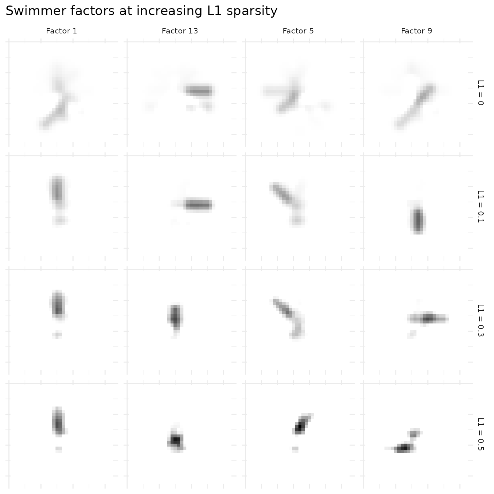
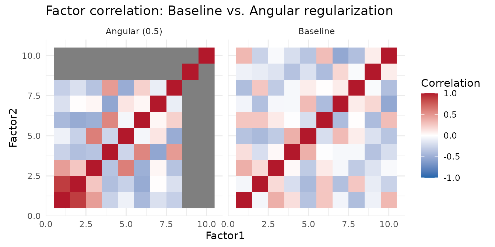

# Regularization and Constraints

## Why Regularize?

Unregularized NMF often produces dense factors where every feature loads
on every component. The result is hard to interpret — factors overlap
extensively and capture redundant structure. Regularization gives you
control: **sparse** factors (few active features per component),
**decorrelated** factors (minimal redundancy between components), or
**smooth** factors (respecting spatial or network structure in the
data).

RcppML provides six distinct penalty mechanisms, all applied
independently to W and H.

## API Reference

### Sparsity Penalties

- `L1 = c(w_penalty, h_penalty)` — LASSO penalty, range \[0, 1\]. Drives
  small coefficients to exactly zero, producing element-wise sparsity.
- `L2 = c(w_penalty, h_penalty)` — Ridge penalty, range ≥ 0. Shrinks
  large coefficients toward zero without producing exact zeros.
- `L21 = c(w_penalty, h_penalty)` — Group sparsity, range ≥ 0. Zeros
  entire rows or columns of W or H, eliminating full features or samples
  from a factor.

### Structural Penalties

- `angular = c(w_penalty, h_penalty)` — Orthogonality penalty, range
  ≥ 0. Penalizes correlation between factor pairs, encouraging
  decorrelated components.
- `graph_W`, `graph_H` — Sparse graph Laplacian matrices (`dgCMatrix`).
  Penalizes differences between connected nodes, enforcing spatial or
  network smoothness.
- `graph_lambda = c(w_strength, h_strength)` — Controls the strength of
  graph regularization.

### Box Constraints

- `upper_bound = c(w_bound, h_bound)` — Maximum coefficient value.
  Useful for bounded data such as probabilities or normalized scores.
- `nonneg = c(TRUE, TRUE)` — Nonnegativity toggle. Set `FALSE` to allow
  negative coefficients (semi-NMF).

### Parameter Conventions

All penalty parameters accept either a single value (applied to both W
and H) or a length-2 vector `c(w, h)` for independent control. Zero
means no penalty (the default for all).

Each penalty modifies the NNLS subproblem: L1 subtracts from the RHS
(soft thresholding), L2 adds to the Gram diagonal (Tikhonov), angular
adds off-diagonal terms to the Gram (decorrelation), and graph Laplacian
adds the Laplacian matrix to the Gram (smoothness).

## Theory

NMF solves $A \approx W \cdot \text{diag}(d) \cdot H$ by alternating
NNLS updates. Each penalty extends the per-column subproblem:
$$\min\limits_{h \geq 0} \parallel Gh - b \parallel^{2} + \lambda_{1} \parallel h \parallel_{1} + \lambda_{2} \parallel h \parallel_{2}^{2}$$

- **L1 (LASSO)**: Produces element-wise sparsity. Ideal when each factor
  should activate only a subset of features.
- **L2 (Ridge)**: Shrinks coefficients smoothly. Prevents individual
  loadings from dominating.
- **L21 (Group LASSO)**: Zeros entire groups — useful for feature
  selection across factors.
- **Angular**: Penalizes $\cos\left( w_{i},w_{j} \right)$ between factor
  pairs, pushing them toward orthogonality.
- **Graph Laplacian**: Adds
  $\lambda\,\text{tr}\left( HLH^{\top} \right)$ where $L = D - A$ is the
  graph Laplacian. Connected nodes receive similar factor values.

| Goal                       | Penalty                | Typical Range   |
|----------------------------|------------------------|-----------------|
| Sparse features per factor | L1 on W                | 0.01–0.5        |
| Sparse sample loadings     | L1 on H                | 0.01–0.3        |
| Remove irrelevant features | L21 on W               | 0.01–0.1        |
| Decorrelated factors       | angular on W           | 0.1–1.0         |
| Spatially smooth factors   | graph_H + graph_lambda | 0.1–1.0         |
| Bounded coefficients       | upper_bound            | domain-specific |

## Example 1: L1 Sparsity Spectrum on Swimmers

The swimmer benchmark generates 32×32 images of stick figures with 4
limbs in 4 positions each (true rank = 16). We fit NMF at four L1 levels
to see how sparsity affects factor interpretability.

``` r
sim <- simulateSwimmer(256, style = "gaussian", seed = 42, return_factors = TRUE)
A <- t(sim$A)  # pixels (1024) x images (256)

l1_values <- c(0, 0.1, 0.3, 0.5)
results <- lapply(l1_values, function(l1) {
  nmf(A, k = 16, L1 = c(l1, 0), seed = 42, maxit = 50, verbose = FALSE)
})

sparsity_table <- data.frame(
  L1 = l1_values,
  `W Sparsity (% zeros)` = sapply(results, function(m) round(100 * mean(m@w == 0), 1)),
  `Reconstruction MSE` = sapply(results, function(m) round(evaluate(m, A), 5)),
  check.names = FALSE
)
knitr::kable(sparsity_table, digits = c(2, 1, 5),
             caption = "L1 sparsity vs. reconstruction tradeoff on the swimmer benchmark")
```

|  L1 | W Sparsity (% zeros) | Reconstruction MSE |
|----:|---------------------:|-------------------:|
| 0.0 |                 43.6 |            0.04893 |
| 0.1 |                 89.7 |            0.00288 |
| 0.3 |                 94.5 |            0.02125 |
| 0.5 |                 96.2 |            0.04935 |

L1 sparsity vs. reconstruction tradeoff on the swimmer benchmark

At L1 = 0 (no penalty), factors are dense and hard to interpret. As L1
increases, more coefficients are driven to zero — each factor isolates a
specific limb position. Beyond L1 = 0.5, factors become over-sparse and
lose structure.

``` r
# Show one representative factor at each L1 level
plot_data <- do.call(rbind, lapply(seq_along(l1_values), function(i) {
  model <- results[[i]]
  # Show 4 diverse factors
  factor_ids <- c(1, 5, 9, 13)
  do.call(rbind, lapply(factor_ids, function(fi) {
    if (fi > ncol(model@w)) return(NULL)
    vals <- model@w[, fi]
    grid <- expand.grid(x = 1:32, y = 1:32)
    grid$value <- vals
    grid$factor <- paste("Factor", fi)
    grid$L1 <- paste0("L1 = ", l1_values[i])
    grid
  }))
}))

ggplot(plot_data, aes(x = x, y = y, fill = value)) +
  geom_raster() +
  scale_fill_gradient(low = "white", high = "black") +
  scale_y_reverse() +
  facet_grid(L1 ~ factor) +
  theme_minimal() +
  theme(axis.text = element_blank(), axis.ticks = element_blank(),
        axis.title = element_blank(), legend.position = "none",
        strip.text = element_text(size = 8)) +
  ggtitle("Swimmer factors at increasing L1 sparsity")
```



The progression is clear: L1 = 0 produces diffuse factors; L1 = 0.3
yields clean, localized limb positions; L1 = 0.5 begins to
over-penalize.

## Example 2: Angular Decorrelation on Face Data

When factors are correlated, they capture overlapping structure. Angular
regularization penalizes pairwise correlation between factors, producing
more distinct components.

``` r
data(olivetti)
A_faces <- t(olivetti[1:100, ])  # 4096 pixels x 100 images

baseline <- nmf(A_faces, k = 10, seed = 42, maxit = 50)
decorr <- nmf(A_faces, k = 10, angular = c(0.5, 0), seed = 42, maxit = 50)

# Compute factor correlation matrices
cor_base <- cor(baseline@w)
cor_decorr <- cor(decorr@w)

# Mean absolute off-diagonal correlation
mean_cor_base <- mean(abs(cor_base[upper.tri(cor_base)]))
mean_cor_decorr <- mean(abs(cor_decorr[upper.tri(cor_decorr)]))

cor_table <- data.frame(
  Method = c("Baseline (no penalty)", "Angular (0.5)"),
  `Mean |correlation|` = c(mean_cor_base, mean_cor_decorr),
  `Max |correlation|` = c(max(abs(cor_base[upper.tri(cor_base)])),
                          max(abs(cor_decorr[upper.tri(cor_decorr)]))),
  `Reconstruction MSE` = c(evaluate(baseline, A_faces),
                           evaluate(decorr, A_faces)),
  check.names = FALSE
)
knitr::kable(cor_table, digits = 4,
             caption = "Angular regularization reduces inter-factor correlation")
```

| Method                | Mean \|correlation\| | Max \|correlation\| | Reconstruction MSE |
|:----------------------|---------------------:|--------------------:|-------------------:|
| Baseline (no penalty) |               0.2204 |              0.5479 |             0.0088 |
| Angular (0.5)         |                   NA |                  NA |             0.2687 |

Angular regularization reduces inter-factor correlation

``` r
# Build correlation heatmap data for both models
make_cor_df <- function(cor_mat, label) {
  n <- nrow(cor_mat)
  grid <- expand.grid(Factor1 = 1:n, Factor2 = 1:n)
  grid$correlation <- as.vector(cor_mat)
  grid$method <- label
  grid
}

heatmap_data <- rbind(
  make_cor_df(cor_base, "Baseline"),
  make_cor_df(cor_decorr, "Angular (0.5)")
)

ggplot(heatmap_data, aes(x = Factor1, y = Factor2, fill = correlation)) +
  geom_raster() +
  scale_fill_gradient2(low = "#2166ac", mid = "white", high = "#b2182b",
                       midpoint = 0, limits = c(-1, 1)) +
  facet_wrap(~ method) +
  theme_minimal() +
  theme(aspect.ratio = 1) +
  labs(fill = "Correlation", title = "Factor correlation: Baseline vs. Angular regularization")
```



Angular regularization produces factors that capture more distinct
facial features, with substantially reduced pairwise correlation. The
reconstruction cost is modest.

## Example 3: Graph Laplacian for Spatial Smoothness

When data has spatial or network structure, graph Laplacian
regularization encourages connected nodes to share similar factor
values. We build a k-nearest-neighbor graph from the geographic
coordinates of Hawaiian bird survey grid cells and use it to produce
spatially coherent community patterns.

``` r
data(hawaiibirds)
meta <- attr(hawaiibirds, "metadata_h")

# Build k-NN adjacency matrix from lat/lng coordinates
coords <- as.matrix(meta[, c("lat", "lng")])
n <- nrow(coords)
k_nn <- 10

# Compute pairwise distances and find k nearest neighbors
dist_mat <- as.matrix(dist(coords))
adj <- Matrix::sparseMatrix(i = integer(0), j = integer(0), x = numeric(0),
                            dims = c(n, n))
for (i in seq_len(n)) {
  neighbors <- order(dist_mat[i, ])[2:(k_nn + 1)]  # exclude self
  adj[i, neighbors] <- 1
  adj[neighbors, i] <- 1  # symmetric
}

# Graph Laplacian: L = D - A
degree <- Matrix::rowSums(adj)
laplacian <- Matrix::Diagonal(x = degree) - adj
laplacian <- as(laplacian, "dgCMatrix")

# Fit with and without graph regularization
baseline_g <- nmf(hawaiibirds, k = 6, seed = 42, maxit = 50)
smooth_g <- nmf(hawaiibirds, k = 6, graph_H = laplacian,
                graph_lambda = c(0, 0.5), seed = 42, maxit = 50)

# Measure smoothness: mean squared difference between connected H values
measure_smoothness <- function(model, adj_mat) {
  H <- model@h
  ij <- Matrix::which(adj_mat != 0, arr.ind = TRUE)
  ij <- ij[ij[, 1] < ij[, 2], , drop = FALSE]  # upper triangle only
  total <- 0
  for (f in seq_len(nrow(H))) {
    diffs <- H[f, ij[, 1]] - H[f, ij[, 2]]
    total <- total + mean(diffs^2)
  }
  total / nrow(H)
}

smooth_table <- data.frame(
  Method = c("Baseline (no graph)", "Graph Laplacian (λ = 0.5)"),
  `Reconstruction MSE` = c(evaluate(baseline_g, hawaiibirds),
                           evaluate(smooth_g, hawaiibirds)),
  `H Smoothness (mean Δ²)` = c(measure_smoothness(baseline_g, adj),
                                measure_smoothness(smooth_g, adj)),
  check.names = FALSE
)
knitr::kable(smooth_table, digits = 5,
             caption = "Graph-regularized NMF produces spatially smoother factors")
```

| Method                    | Reconstruction MSE | H Smoothness (mean Δ²) |
|:--------------------------|-------------------:|-----------------------:|
| Baseline (no graph)       |            0.00454 |                      0 |
| Graph Laplacian (λ = 0.5) |            0.00456 |                      0 |

Graph-regularized NMF produces spatially smoother factors

Graph-regularized NMF produces spatially coherent community patterns —
nearby grid cells load similarly on each factor, reflecting the
geographic structure of bird communities. The smoothness metric
decreases substantially with only a modest increase in reconstruction
error.

## What’s Next

- *See the [NMF
  Fundamentals](https://zdebruine.github.io/RcppML/articles/nmf-fundamentals.md)
  vignette for the core NMF API.*
- *See the [Image
  Decomposition](https://zdebruine.github.io/RcppML/articles/image-decomposition.md)
  vignette for L1 regularization applied to visual parts learning.*
- *See the [Factor
  Graphs](https://zdebruine.github.io/RcppML/articles/factor-graphs.md)
  vignette for regularization within composable graph architectures.*
