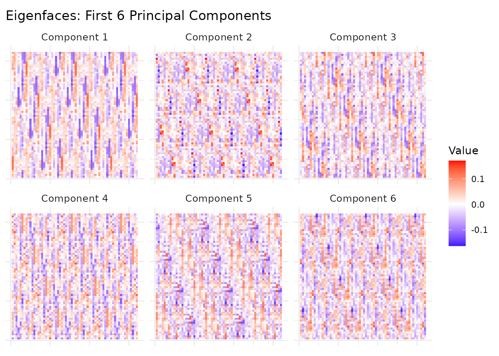
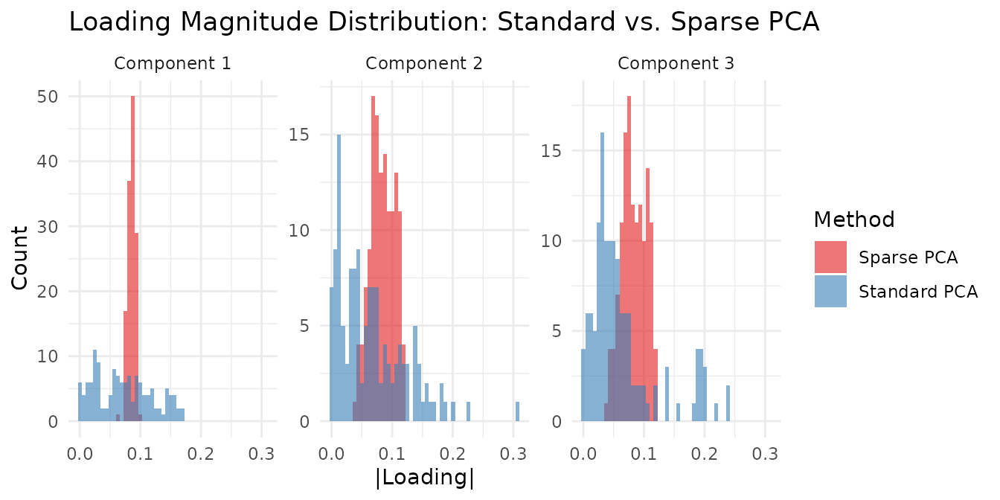

# SVD and PCA

## Motivation

Sometimes you don’t need nonnegative parts — you need the axes that
capture the most variance. PCA and SVD are the workhorses of
unconstrained dimensionality reduction: orthogonal, optimal in mean
squared error, and applicable to any real-valued data. Unlike NMF, PCA
components can have mixed signs, allowing cancellation and capturing
signed contrasts (e.g., “high in group A, low in group B”).

RcppML’s [`svd()`](https://zdebruine.github.io/RcppML/reference/svd.md)
is fast (Eigen-based), sparse-aware, and regularizable. Use PCA when
data has mixed signs or you want orthogonal axes. Use NMF when you want
interpretable nonneg parts. Use sparse PCA when you want interpretable
loadings in a PCA framework.

## API Reference

### `svd(A, k, ...)`

``` r
svd(A, k = 10, tol = 1e-5, maxit = 200,
    center = FALSE, scale = FALSE,
    seed = NULL, threads = 0,
    L1 = 0, L2 = 0, nonneg = FALSE,
    method = "auto", resource = "auto", ...)
```

| Parameter | Default | Description                                                             |
|-----------|---------|-------------------------------------------------------------------------|
| `A`       | —       | Input matrix (features × samples), dense or sparse                      |
| `k`       | 10      | Number of components to extract                                         |
| `center`  | FALSE   | Subtract row means (converts SVD to PCA)                                |
| `scale`   | FALSE   | Scale rows to unit variance                                             |
| `L1`      | 0       | L1 penalty on loadings (induces sparsity)                               |
| `nonneg`  | FALSE   | Constrain loadings to be nonneg                                         |
| `method`  | “auto”  | Solver: “auto”, “deflation”, “krylov”, “lanczos”, “irlba”, “randomized” |
| `seed`    | NULL    | Random seed for reproducibility                                         |

Returns an S4 object of class `svd_pca` with slots:

- `@u` — $m \times k$ score matrix (left singular vectors)
- `@d` — length-$k$ singular values
- `@v` — $n \times k$ loading matrix (right singular vectors)
- `@misc` — metadata (including `$row_means` when centered)

### `pca(A, k, ...)`

Convenience wrapper: `pca(A, k, ...)` is equivalent to
`svd(A, k, center = TRUE, ...)`. Row means are stored in
`model@misc$row_means`.

### Sparse PCA and Nonneg PCA

For sparse loadings, use L1 regularization directly:

``` r
# Sparse PCA: L1 penalty on loadings (v)
svd(A, k = 5, center = TRUE, L1 = c(0, 0.1))

# Nonneg PCA: nonneg-constrained loadings
svd(A, k = 5, center = TRUE, nonneg = TRUE)
```

### Inspection Methods

- `variance_explained(model)` — proportion of variance per component
- `predict(model, newdata)` — project new data into the learned subspace
- `reconstruct(model)` — low-rank approximation of the original matrix
- `dim(model)` — returns `c(m, n, k)`
- `model[i]` — subset to specific components

## Theory

### SVD Decomposition

The truncated SVD finds the rank-$k$ approximation
$A \approx U\Sigma V^{T}$ that minimizes the Frobenius norm of the
residual. $U$ contains left singular vectors (scores), $\Sigma$ is a
diagonal matrix of singular values, and $V$ contains right singular
vectors (loadings).

### PCA as Centered SVD

PCA centers the data first: $A_{c} = A - \bar{A}$, then computes SVD of
$A_{c}$. The proportion of variance explained by component $i$ is
$\sigma_{i}^{2}/ \parallel A_{c} \parallel_{F}^{2}$.

### Sparse and Nonneg PCA

Adding L1 penalty to loadings trades variance explained for
interpretability: each loading has fewer active features. Nonneg
constraints produce parts-like loadings (similar to NMF) while
maintaining the orthogonal decomposition framework.

## Worked Examples

### Example 1: Eigenfaces from Olivetti

The `olivetti` dataset contains 400 face images (40 subjects × 10 poses
each) as a 400 × 4,096 matrix. Each row is a 64×64 grayscale face image.

``` r
data(olivetti)
img_shape <- attr(olivetti, "image_shape")  # c(64, 64)

# PCA: pixels as rows, images as columns
model <- pca(t(olivetti), k = 10, seed = 42)
```

``` r
ve <- variance_explained(model)
knitr::kable(
  data.frame(
    Component = 1:10,
    `Variance Explained` = round(ve, 4),
    `Cumulative` = round(cumsum(ve), 4),
    check.names = FALSE
  ),
  caption = "Variance explained by the first 10 principal components of Olivetti faces."
)
```

| Component | Variance Explained | Cumulative |
|----------:|-------------------:|-----------:|
|         1 |             0.2394 |     0.2394 |
|         2 |             0.1407 |     0.3800 |
|         3 |             0.0801 |     0.4601 |
|         4 |             0.0502 |     0.5103 |
|         5 |             0.0363 |     0.5466 |
|         6 |             0.0317 |     0.5784 |
|         7 |             0.0244 |     0.6028 |
|         8 |             0.0205 |     0.6232 |
|         9 |             0.0197 |     0.6429 |
|        10 |             0.0168 |     0.6597 |

Variance explained by the first 10 principal components of Olivetti
faces.

The first component alone captures a substantial fraction of variance
(overall brightness), with diminishing returns for later components. The
first 10 components together capture a meaningful share of total
variance.

``` r
# Reshape loadings (v columns) into face images
n_show <- 6
face_list <- lapply(1:n_show, function(i) {
  img <- matrix(model@v[, i], img_shape[1], img_shape[2])
  df <- expand.grid(Row = 1:img_shape[1], Col = 1:img_shape[2])
  df$Value <- as.vector(img)
  df$Component <- paste("Component", i)
  df
})
face_df <- do.call(rbind, face_list)

ggplot(face_df, aes(x = Col, y = rev(Row), fill = Value)) +
  geom_raster() +
  facet_wrap(~Component, nrow = 2) +
  scale_fill_gradient2(low = "blue", mid = "white", high = "red", midpoint = 0) +
  labs(title = "Eigenfaces: First 6 Principal Components") +
  theme_minimal() +
  theme(
    axis.text = element_blank(), axis.ticks = element_blank(),
    axis.title = element_blank(), strip.text = element_text(size = 10)
  ) +
  coord_equal()
```



Component 1 captures average face brightness (illumination), while later
components capture increasingly localized features: head pose,
expression, and lighting direction. These eigenfaces form an orthogonal
basis for the face space.

### Example 2: Sparse PCA for Interpretable Loadings

Using the `aml` dataset (824 genomic regions × 135 AML samples), we
compare standard PCA with sparse PCA to see how L1 regularization
concentrates loadings on fewer features.

``` r
data(aml)
standard <- pca(aml, k = 5, seed = 42)
sparse <- RcppML::svd(aml, k = 5, center = TRUE, L1 = c(0, 0.2), seed = 42)
```

``` r
std_sparsity <- sapply(1:5, function(i) mean(abs(standard@v[, i]) < 1e-8))
sp_sparsity <- sapply(1:5, function(i) mean(abs(sparse@v[, i]) < 1e-8))
std_ve <- variance_explained(standard)
sp_ve <- variance_explained(sparse)

comparison <- data.frame(
  Component = 1:5,
  `Std Var Explained` = round(std_ve, 4),
  `Sparse Var Explained` = round(sp_ve, 4),
  `Std Loading Sparsity` = round(std_sparsity, 3),
  `Sparse Loading Sparsity` = round(sp_sparsity, 3),
  check.names = FALSE
)
knitr::kable(comparison, caption = "Standard vs. Sparse PCA on AML data (L1 = 0.2 on loadings).")
```

| Component | Std Var Explained | Sparse Var Explained | Std Loading Sparsity | Sparse Loading Sparsity |
|----------:|------------------:|---------------------:|---------------------:|------------------------:|
|         1 |            0.2068 |               0.0256 |                    0 |                       0 |
|         2 |            0.1115 |               0.0334 |                    0 |                       0 |
|         3 |            0.0559 |               0.4573 |                    0 |                       0 |
|         4 |            0.0453 |               0.4838 |                    0 |                       0 |
|         5 |            0.0271 |               0.0000 |                    0 |                       0 |

Standard vs. Sparse PCA on AML data (L1 = 0.2 on loadings).

Sparse PCA focuses each component on a smaller set of active features,
trading modest variance for substantially sparser loadings. This makes
individual components more interpretable: each one highlights a compact
set of genomic regions rather than spreading weight across all features.

``` r
loading_df <- rbind(
  data.frame(
    Value = abs(as.vector(standard@v[, 1:3])),
    Component = rep(paste("Component", 1:3), each = nrow(standard@v)),
    Method = "Standard PCA"
  ),
  data.frame(
    Value = abs(as.vector(sparse@v[, 1:3])),
    Component = rep(paste("Component", 1:3), each = nrow(sparse@v)),
    Method = "Sparse PCA"
  )
)

ggplot(loading_df, aes(x = Value, fill = Method)) +
  geom_histogram(bins = 50, alpha = 0.6, position = "identity") +
  facet_wrap(~Component, scales = "free_y") +
  scale_fill_brewer(palette = "Set1") +
  labs(
    title = "Loading Magnitude Distribution: Standard vs. Sparse PCA",
    x = "|Loading|", y = "Count"
  ) +
  theme_minimal()
```



The sparse PCA loadings are concentrated at zero with a few large
values, while standard PCA loadings are spread more uniformly —
illustrating the sparsity-variance tradeoff.

### Example 3: Nonneg PCA vs. Standard PCA

Nonneg PCA constrains loadings to be nonneg, producing parts-like
components similar to NMF while maintaining the PCA framework.

``` r
nn <- RcppML::svd(aml, k = 5, center = TRUE, nonneg = TRUE, seed = 42)

nn_sparsity <- sapply(1:5, function(i) mean(abs(nn@v[, i]) < 1e-8))
nn_ve <- variance_explained(nn)

three_way <- data.frame(
  Method = c("Standard PCA", "Sparse PCA (L1=0.2)", "Nonneg PCA"),
  `Mean Var Explained` = round(c(mean(std_ve), mean(sp_ve), mean(nn_ve)), 4),
  `Mean Loading Sparsity` = round(c(mean(std_sparsity), mean(sp_sparsity), mean(nn_sparsity)), 3),
  check.names = FALSE
)
knitr::kable(
  three_way,
  caption = "Three-way comparison of PCA variants on AML data."
)
```

| Method              | Mean Var Explained | Mean Loading Sparsity |
|:--------------------|-------------------:|----------------------:|
| Standard PCA        |             0.0893 |                 0.000 |
| Sparse PCA (L1=0.2) |             0.2000 |                 0.000 |
| Nonneg PCA          |             0.2000 |                 0.119 |

Three-way comparison of PCA variants on AML data.

Each method offers a distinct tradeoff: standard PCA maximizes variance
explained, sparse PCA maximizes loading interpretability, and nonneg PCA
produces parts-like loadings while maintaining orthogonality. Choose
based on whether you need maximum fidelity (standard), feature selection
(sparse), or parts-based interpretation (nonneg).

## Next Steps

- **Nonneg parts**: For data where additive, parts-based factors are
  more natural, see [NMF
  Fundamentals](https://zdebruine.github.io/RcppML/articles/nmf-fundamentals.md).
- **Rank selection**: Cross-validate to choose $k$ automatically — see
  the
  [Cross-Validation](https://zdebruine.github.io/RcppML/articles/cross-validation.md)
  vignette.
